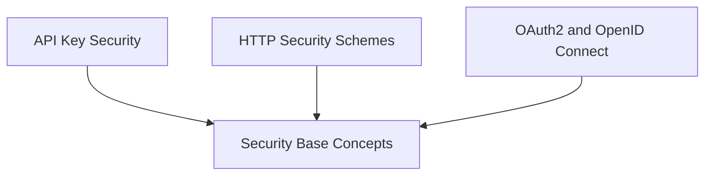

# Security Module

The `security_module` is responsible for providing various authentication and authorization mechanisms to secure API endpoints. It offers implementations for common security schemes such as API keys, HTTP authentication (Basic, Bearer, Digest), and OAuth2/OpenID Connect.

## Architecture Overview

The security module is structured into several sub-modules, each handling a specific aspect of security. These sub-modules are designed to be modular and extensible, allowing for easy integration of new security protocols.

<!-- DIAGRAM_JSON
{
    "direction": "TD",
    "nodes": [
        {"id": "security_base_concepts", "label": "Security Base Concepts", "type": "module", "link": "security_base_concepts.md"},
        {"id": "api_key_security", "label": "API Key Security", "type": "module", "link": "api_key_security.md"},
        {"id": "http_security", "label": "HTTP Security Schemes", "type": "module", "link": "http_security.md"},
        {"id": "oauth2_openid_connect", "label": "OAuth2 and OpenID Connect", "type": "module", "link": "oauth2_openid_connect.md"}
    ],
    "edges": [
        {"source": "api_key_security", "target": "security_base_concepts"},
        {"source": "http_security", "target": "security_base_concepts"},
        {"source": "oauth2_openid_connect", "target": "security_base_concepts"}
    ],
    "groups": []
}
-->

## Sub-modules

- ### [API Key Security](api_key_security.md)
  This sub-module focuses on various methods of API key authentication, including keys passed via cookies, query parameters, and HTTP headers.

- ### [HTTP Security Schemes](http_security.md)
  Provides implementations for standard HTTP authentication schemes like Basic, Bearer, and Digest, essential for securing web communications.

- ### [OAuth2 and OpenID Connect](oauth2_openid_connect.md)
  Dedicated to handling modern authentication and authorization protocols such as OAuth2 (with various flows like password and authorization code) and OpenID Connect.

- ### [Security Base Concepts](security_base_concepts.md)
  Defines the fundamental building blocks and base classes for all security schemes, ensuring a consistent and extensible framework for security implementations.