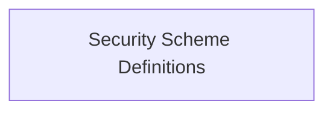

# Security Scheme Definitions

Defines enumeration for API key input locations (header, query, cookie) and the general types of security schemes.

## Components

This module contains 2 component(s):

- `APIKeyIn`
- `SecuritySchemeType`

## Structure

---
*This documentation was auto-generated to ensure completeness.*
