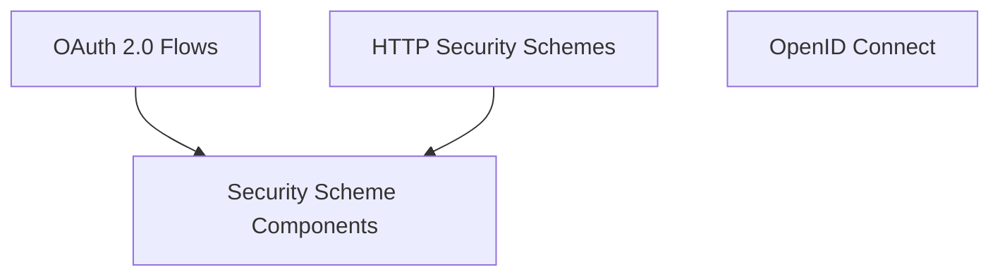

# Security Schemes Module Documentation

## Introduction and Purpose

The `security_schemes` module within `openapi_models_module` is responsible for defining and managing various security schemes used to protect API endpoints as per the OpenAPI Specification. It provides data structures and models for different authentication methods like HTTP Bearer, API Keys, OAuth 2.0 flows, and OpenID Connect, enabling clear and consistent security definitions across the API.

## Architecture Overview

The `security_schemes` module is structured into several sub-modules, each dedicated to a specific category of security mechanisms. This modular approach ensures clarity, maintainability, and easy extension of security definitions. It integrates closely with other `openapi_models_module` components, particularly `schema_definitions` for data structures and `api_structure` for applying these schemes to API operations.

<!-- DIAGRAM_JSON
{
    "direction": "TD",
    "nodes": [
        {"id": "http_security", "label": "HTTP Security Schemes", "type": "module", "link": "http_security.md"},
        {"id": "oauth_flows", "label": "OAuth 2.0 Flows", "type": "module", "link": "oauth_flows.md"},
        {"id": "openid_connect", "label": "OpenID Connect", "type": "module", "link": "openid_connect.md"},
        {"id": "scheme_components", "label": "Security Scheme Components", "type": "module", "link": "scheme_components.md"}
    ],
    "edges": [
        {"source": "oauth_flows", "target": "scheme_components"},
        {"source": "http_security", "target": "scheme_components"}
    ],
    "groups": []
}
-->

## Sub-module Functionality

This section provides a high-level overview of the sub-modules within `security_schemes`:

*   ### [HTTP Security Schemes](http_security.md)
    This sub-module focuses on defining standard HTTP-based authentication methods, including Bearer token authentication and API key mechanisms. It uses components like `HTTPBearer` and `APIKeyIn` to specify how these schemes are applied.

*   ### [OAuth 2.0 Flows](oauth_flows.md)
    Dedicated to the various OAuth 2.0 authorization flows, this sub-module provides models for Implicit, Password, Client Credentials, and Authorization Code flows. Components such as `OAuthFlows` and `OAuth2` are central to its functionality.

*   ### [OpenID Connect](openid_connect.md)
    This sub-module handles security definitions that leverage OpenID Connect. It encapsulates the necessary configurations for integrating OpenID Connect as an authentication scheme.

*   ### [Security Scheme Components](scheme_components.md)
    This sub-module contains fundamental building blocks for all security schemes, notably `Components`, which allows for reusable security scheme definitions across the API documentation.
