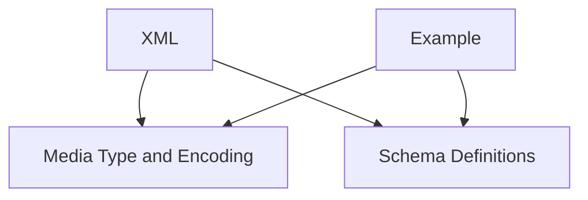

# `xml_and_examples` Module Documentation

## Introduction

The `xml_and_examples` module is a sub-module within the `openapi_models_module`, specifically nested under `schema_definitions` and `media_and_examples`. Its primary responsibility is to define the OpenAPI specification components related to XML serialization and example objects for various data schemas.

## Purpose and Core Functionality

This module encapsulates the definitions for two key OpenAPI components:

*   **`XML`**: This component allows for precise control over how schema properties are serialized to XML. It provides properties such as `name`, `namespace`, `prefix`, `attribute`, and `wrapped` to accurately represent XML structures within OpenAPI documentation. For instance, it can specify if a property should be an XML attribute, part of a specific namespace, or wrapped in an additional XML element.

*   **`Example`**: The `Example` component is used to provide concrete instances or examples of data structures defined by a schema. These examples are invaluable for consumers of an API to understand the expected input and output formats without needing to infer them from the schema definition alone. An `Example` can include a `summary`, `description`, `value` (the actual example payload), and an `externalValue` for referencing external examples.

Together, these components enhance the clarity and usability of OpenAPI specifications by offering detailed XML mapping and practical data examples.

## Architecture and Component Relationships

This module is a leaf module, focusing on the specific implementations of XML and Example objects. It integrates with broader schema definitions and media type handling within the OpenAPI model.

<!-- DIAGRAM_JSON
{
    "direction": "TD",
    "nodes": [
        {"id": "XML_component", "label": "XML", "type": "component", "link": null},
        {"id": "Example_component", "label": "Example", "type": "component", "link": null},
        {"id": "media_type_and_encoding", "label": "Media Type and Encoding", "type": "external", "link": "media_type_and_encoding.md"},
        {"id": "schema_definitions", "label": "Schema Definitions", "type": "external", "link": "schema_definitions.md"}
    ],
    "edges": [
        {"source": "XML_component", "target": "media_type_and_encoding"},
        {"source": "Example_component", "target": "media_type_and_encoding"},
        {"source": "XML_component", "target": "schema_definitions"},
        {"source": "Example_component", "target": "schema_definitions"}
    ],
    "groups": []
}
-->

## How the Module Fits into the Overall System

The `xml_and_examples` module plays a crucial role in enriching the metadata and discoverability of API endpoints defined using OpenAPI. By providing structured ways to describe XML serialization and concrete examples, it significantly improves the developer experience for both API providers and consumers.

It is consumed by higher-level modules that construct the full OpenAPI document, particularly those responsible for defining `schemas` and `media types`. The `XML` and `Example` objects defined here are embedded within `Schema` objects and `MediaType` objects (defined in [schema_definitions.md](schema_definitions.md) and [media_type_and_encoding.md](media_type_and_encoding.md), respectively) to provide a complete and accurate representation of the API's data models.