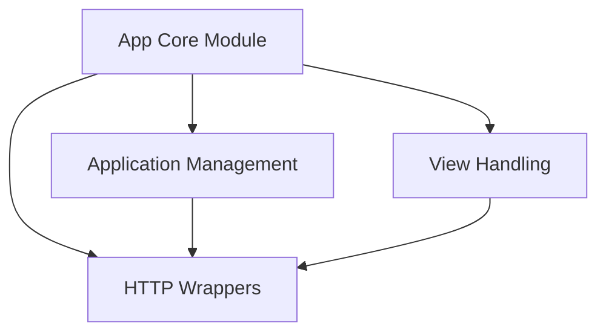

# `app_core` Module Documentation

## Introduction

The `app_core` module serves as the central backbone of a Flask application, encapsulating the fundamental components required for web application development. It brings together the core `Flask` application object, mechanisms for organizing application structure with `Blueprints`, and the essential `Request` and `Response` wrappers that facilitate communication over HTTP. This module provides the foundational classes for handling incoming requests, generating outgoing responses, and defining the overall application logic.

## Architecture

The `app_core` module is structured around key functionalities: application setup and organization, handling of HTTP requests and responses, and the implementation of class-based views. These sub-modules interact to form a coherent system for building Flask applications.

<!-- DIAGRAM_JSON
{
    "direction": "TD",
    "nodes": [
        {"id": "app_core", "label": "App Core Module", "type": "module"},
        {"id": "application_management", "label": "Application Management", "type": "module", "link": "application_management.md"},
        {"id": "http_wrappers", "label": "HTTP Wrappers", "type": "module", "link": "http_wrappers.md"},
        {"id": "view_handling", "label": "View Handling", "type": "module", "link": "view_handling.md"}
    ],
    "edges": [
        {"source": "app_core", "target": "application_management"},
        {"source": "app_core", "target": "http_wrappers"},
        {"source": "app_core", "target": "view_handling"},
        {"source": "application_management", "target": "http_wrappers"},
        {"source": "view_handling", "target": "http_wrappers"}
    ],
    "groups": []
}
-->

## Sub-modules

This section outlines the key sub-modules within `app_core`, each focusing on a specific aspect of application functionality.

*   **[Application Management](application_management.md)**: This sub-module is responsible for the core application instance (`Flask`) and the organization of application components using `Blueprints`. It defines the fundamental structure and configuration of a Flask application, including request and response handling, templating, and URL routing.

*   **[HTTP Wrappers](http_wrappers.md)**: This sub-module provides essential classes for abstracting HTTP requests and responses. It includes `Request` and `Response` objects, which simplify access to incoming request data and streamline the creation of outgoing responses, including functionalities for handling static files and session management.

*   **[View Handling](view_handling.md)**: This sub-module focuses on defining and dispatching views within the Flask application. It includes base classes for generic views (`View`) and method-based views (`MethodView`), allowing developers to structure their request handlers in an organized and reusable manner.