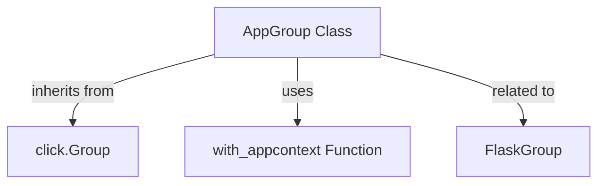

# app_group_commands Module Documentation

## Introduction
The `app_group_commands` module focuses on the `AppGroup` class, a specialized `click.Group` implementation designed for Flask applications. It enhances the standard Click command group functionality by automatically integrating Flask's application context into CLI commands, simplifying the development of command-line interfaces for Flask projects.

## Core Functionality

The primary component of this module is `AppGroup`.

### `AppGroup` Class
The `AppGroup` class extends `click.Group` to provide Flask-specific enhancements for command-line interface development. Its core functionality revolves around ensuring that CLI commands run within a Flask application context, which is crucial for accessing application-specific resources like configuration, database connections, and other Flask extensions.

Key features of `AppGroup`:
-   **Automatic App Context**: By default, commands registered with `AppGroup` are wrapped in the `with_appcontext` function. This ensures that when a command is executed, a Flask application context is pushed, allowing the command function to access `current_app`, `g`, `request`, and `session` proxies, similar to how views in a web application operate.
-   **Customizable Context Wrapping**: The automatic context wrapping can be disabled for specific commands by setting `with_appcontext=False` during command registration.
-   **Nested AppGroups**: The `group` method of `AppGroup` defaults to using `AppGroup` itself for nested command groups, facilitating the creation of complex, context-aware command hierarchies.

**Code Excerpt:**
```python
class AppGroup(click.Group):
    def command(
        self, *args: t.Any, **kwargs: t.Any
    ) -> t.Callable[[t.Callable[..., t.Any]], click.Command]:
        wrap_for_ctx = kwargs.pop("with_appcontext", True)

        def decorator(f: t.Callable[..., t.Any]) -> click.Command:
            if wrap_for_ctx:
                f = with_appcontext(f)
            return super(AppGroup, self).command(*args, **kwargs)(f)

        return decorator

    def group(
        self, *args: t.Any, **kwargs: t.Any
    ) -> t.Callable[[t.Callable[..., t.Any]], click.Group]:
        kwargs.setdefault("cls", AppGroup)
        return super().group(*args, **kwargs)
```

## Architecture and Component Relationships

The `AppGroup` class integrates with several key components to deliver its functionality:

-   **`click.Group`**: `AppGroup` inherits directly from `click.Group`, leveraging Click's robust command-line parsing and dispatching capabilities. It overrides specific methods to introduce Flask-specific behaviors.
-   **`with_appcontext` Function**: This utility function (likely found within the `flask_cli` module) is responsible for pushing and popping a Flask application context around the execution of a CLI command. `AppGroup` uses this function to wrap registered commands, ensuring they operate within the correct application environment.
-   **`FlaskGroup`**: While `AppGroup` is distinct from `FlaskGroup`, they serve similar purposes within the Flask CLI ecosystem. `FlaskGroup` is typically the top-level command group that initializes the Flask application itself, whereas `AppGroup` can be used for sub-command groups within that initialized application context. For more details, refer to the [flask_group_cli module documentation](flask_group_cli.md).

<!-- DIAGRAM_JSON
{
    "direction": "TD",
    "nodes": [
        {"id": "app_group", "label": "AppGroup Class", "type": "component", "link": null},
        {"id": "click_group", "label": "click.Group", "type": "external", "link": null},
        {"id": "with_appcontext_helper", "label": "with_appcontext Function", "type": "external", "link": null},
        {"id": "flask_group", "label": "FlaskGroup", "type": "external", "link": "flask_group_cli.md"}
    ],
    "edges": [
        {"source": "app_group", "target": "click_group", "label": "inherits from"},
        {"source": "app_group", "target": "with_appcontext_helper", "label": "uses"},
        {"source": "app_group", "target": "flask_group", "label": "related to"}
    ],
    "groups": []
}
-->


## How it Fits into the Overall System
The `app_group_commands` module, through its `AppGroup` component, is a fundamental part of the Flask CLI system, residing within the broader [flask_cli module](flask_cli.md). It enables developers to seamlessly extend Flask applications with command-line tools that can interact with the application's internal components and data, leveraging the full Flask context. It simplifies the process of creating management commands, data migrations, or any other script that needs access to the Flask application's environment, thereby promoting consistency and reducing boilerplate code for CLI development in Flask projects.
