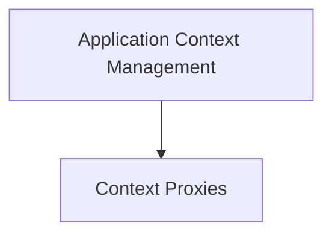

# Application Context Module

The `application_context` module in Flask is responsible for managing the application context, which provides a runtime environment for Flask applications. This context holds essential information related to the current application instance, making it accessible throughout the lifecycle of a request or a command-line interface (CLI) execution.

## Purpose and Core Functionality

This module ensures that various components of a Flask application, such as the application object (`current_app`), request object (`request`), and session object (`session`), are available in a thread-local proxy. It streamlines how application-wide data and resources are managed and accessed, especially during the processing of HTTP requests or CLI commands.

## Architecture Overview

The application context is a fundamental concept in Flask's architecture, providing a dedicated scope for application-specific operations. It establishes a boundary for application data and ensures proper cleanup after operations are complete.

<!-- DIAGRAM_JSON
{
    "direction": "TD",
    "nodes": [
        {"id": "application_context_management", "label": "Application Context Management", "type": "module", "link": "application_context_management.md"},
        {"id": "context_proxies", "label": "Context Proxies", "type": "module", "link": "context_proxies.md"}
    ],
    "edges": [
        {"source": "application_context_management", "target": "context_proxies"}
    ],
    "groups": []
}
-->

## Sub-modules

### [Application Context Management](application_context_management.md)
Handles the creation, management, and teardown of the application context, including global storage specific to the context.