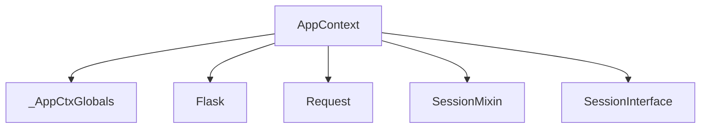

# Module: `application_context_management`

## Introduction
The `application_context_management` module is a crucial part of Flask's context system, responsible for managing the application context and providing mechanisms for storing and accessing application-specific and request-specific global data. It centralizes information about the Flask application and, when applicable, the current request, enabling proper resource management and ensuring that global state is handled safely across different execution paths (e.g., requests, CLI commands).

## Comprehensive Documentation

### Purpose and Core Functionality
This module primarily defines the `AppContext` and `_AppCtxGlobals` classes, which are fundamental to how Flask manages its operational environment.

The **`AppContext`** class represents the application context. It's a container that holds essential information, including:
*   The `Flask` application instance (`self.app`).
*   Global data for the context, accessible via the `g` proxy (`self.g`).
*   The `Request` object (if it's a request context).
*   The `SessionMixin` object, which provides access to session data.
*   The URL adapter for routing.

`AppContext` manages the lifecycle of the application context through `push()` and `pop()` methods, which are typically invoked automatically by Flask. When an `AppContext` is active, application-specific resources and data become available through proxies like `current_app`, `g`, `request`, and `session`. Teardown functions registered with the application are executed when the context is popped, ensuring proper cleanup.

The **`_AppCtxGlobals`** class serves as a simple namespace object for storing arbitrary data within the current application context. It's exposed through the `g` proxy (available as `flask.g`), allowing developers to store and retrieve data that is local to a specific application context (and thus, often specific to a request or CLI command). This prevents pollution of global variables and facilitates thread-safe access to contextual data.

### Architecture and Component Relationships

<!-- DIAGRAM_JSON
{
    "direction": "TD",
    "nodes": [
        {"id": "app_context", "label": "AppContext", "type": "component", "link": null},
        {"id": "app_ctx_globals", "label": "_AppCtxGlobals", "type": "component", "link": null},
        {"id": "flask_app", "label": "Flask", "type": "external", "link": "application_core.md"},
        {"id": "request_obj", "label": "Request", "type": "external", "link": "http_wrappers_components.md"},
        {"id": "session_mixin", "label": "SessionMixin", "type": "external", "link": "session_management.md"},
        {"id": "session_interface", "label": "SessionInterface", "type": "external", "link": "session_management.md"}
    ],
    "edges": [
        {"source": "app_context", "target": "app_ctx_globals"},
        {"source": "app_context", "target": "flask_app"},
        {"source": "app_context", "target": "request_obj"},
        {"source": "app_context", "target": "session_mixin"},
        {"source": "app_context", "target": "session_interface"}
    ],
    "groups": []
}
-->

**`AppContext`**:
*   **Composes `_AppCtxGlobals`**: An instance of `_AppCtxGlobals` is created and managed by `AppContext` to provide the `g` object.
*   **Interacts with `Flask`**: It receives the `Flask` application instance during its initialization and uses it to access configuration, session interface, and register teardown functions.
*   **Depends on `Request`**: If the `AppContext` is a request context, it encapsulates a `Request` object, providing access to incoming HTTP request details.
*   **Manages `SessionMixin`**: It holds a reference to a `SessionMixin` instance, which represents the current user's session data.
*   **Uses `SessionInterface`**: When session data is accessed for the first time, `AppContext` uses the application's `SessionInterface` to open or create a session.

**`_AppCtxGlobals`**:
*   This is a simpler component, primarily acting as a dictionary-like object to store arbitrary data that needs to be accessible globally within the current application context. It does not have direct dependencies on other core components besides being instantiated and managed by `AppContext`.

### How the Module Fits into the Overall System
The `application_context_management` module is central to Flask's ability to manage global state in a thread-safe and clean manner.

*   **Request Handling**: For every incoming HTTP request, a new `AppContext` (which also acts as a request context) is pushed. This makes the `request`, `session`, `g`, and `current_app` proxies point to the correct objects for that specific request. After the request is processed, the context is popped, and cleanup operations are performed.
*   **CLI Commands**: Similarly, when a Flask CLI command is executed, an `AppContext` is pushed to provide access to `current_app` and `g`, ensuring that command-line scripts operate within the application's configured environment.
*   **Testing**: In testing scenarios, `AppContext` (and by extension, request contexts) can be manually pushed and popped using `Flask.app_context()` and `Flask.test_request_context()` to simulate an application environment for unit and integration tests.
*   **Resource Management**: By providing `push` and `pop` mechanisms and integrating with Flask's teardown functions, this module ensures that resources (like database connections) are properly initialized and closed at the appropriate times.

In essence, `application_context_management` provides the essential framework for Flask's contextual globals, allowing different parts of an application to access context-specific information without explicitly passing arguments everywhere, while maintaining isolation between concurrent requests or operations. It works closely with the [context_proxies module](context_proxies.md) which provides the actual proxy objects (`current_app`, `g`, `request`, `session`) that applications use to interact with the context.
