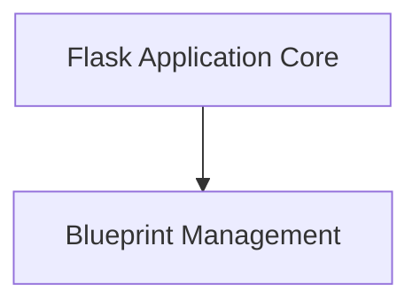

# Application Management Module Documentation

## Introduction

The `application_management` module is central to building Flask applications, providing the core components for defining the application instance and organizing its structure into reusable blueprints. It encompasses the fundamental `Flask` application object and the `Blueprint` mechanism for modular development.

## Architecture Overview

The `application_management` module comprises two key sub-modules: `application_core` and `blueprint_management`. The `application_core` handles the main application instance and its global configurations and lifecycle. The `blueprint_management` allows developers to define isolated, reusable components of an application, which can then be registered with the main `Flask` application.

<!-- DIAGRAM_JSON
{
    "direction": "TD",
    "nodes": [
        {"id": "application_core", "label": "Flask Application Core", "type": "module", "link": "application_core.md"},
        {"id": "blueprint_management", "label": "Blueprint Management", "type": "module", "link": "blueprint_management.md"}
    ],
    "edges": [
        {"source": "application_core", "target": "blueprint_management"}
    ],
    "groups": []
}
-->

## High-Level Functionality

*   **[Flask Application Core](application_core.md)**: This sub-module is built around the `Flask` class, which serves as the WSGI application and the central registry for an application. It manages URL rules, template configuration, request and response handling, context management, and CLI commands. It's the entry point for defining and running a Flask application.

*   **[Blueprint Management](blueprint_management.md)**: This sub-module introduces the `Blueprint` class, a way to organize a group of related views and other code. Blueprints allow for modularity by registering them with a `Flask` application, making it easier to scale and maintain larger applications. They provide mechanisms for handling static files, templates, and URL prefixes specific to a blueprint.
