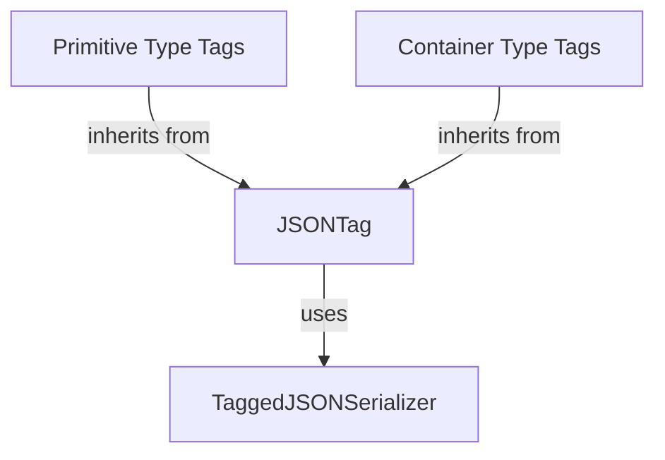

# `base_tagging` Module

The `base_tagging` module provides the foundational `JSONTag` class, which serves as the base for defining custom type tags used by the [`TaggedJSONSerializer`](serializer_core.md). This module is crucial for extending Flask's JSON serialization capabilities to handle complex or custom Python objects.

## Purpose and Core Functionality

The primary purpose of `base_tagging` is to offer a standardized interface for creating "taggers" – classes that know how to serialize and deserialize specific Python types to and from JSON-compatible formats. The `JSONTag` class defines the contract for these taggers, ensuring consistency across different custom types.

It enables developers to:

*   **Define custom serialization logic**: Implement `to_json` and `to_python` methods for specific Python types.
*   **Integrate with `TaggedJSONSerializer`**: The `TaggedJSONSerializer` uses `JSONTag` instances to identify and process objects during serialization and deserialization.
*   **Create extensible JSON handling**: By inheriting from `JSONTag`, new data types can be seamlessly added to Flask's JSON serialization pipeline.

## Architecture and Component Relationships

The `base_tagging` module revolves around the `JSONTag` class. Other specific tag implementations, found in modules like [`primitive_type_tags`](primitive_type_tags.md) and [`container_type_tags`](container_type_tags.md), inherit from `JSONTag` to provide concrete serialization strategies for various data types.

### `JSONTag` Class

`JSONTag` is an abstract base class that outlines the necessary methods for any type tag. It includes:

*   `key`: A string attribute representing the unique tag identifier for the serialized object. If empty, the tag is used as an intermediate step.
*   `__init__(self, serializer)`: Initializes the tagger with an instance of the `TaggedJSONSerializer`, establishing a link to the overarching serialization mechanism.
*   `check(self, value)`: An abstract method that child classes must implement to determine if a given Python `value` should be handled by this specific tag.
*   `to_json(self, value)`: An abstract method for converting a Python `value` into a JSON-compatible representation. This method focuses solely on the conversion, without adding the tag structure.
*   `to_python(self, value)`: An abstract method for converting a JSON-compatible `value` back into its original Python type, assuming the tag structure has already been removed.
*   `tag(self, value)`: A concrete method that wraps the JSON-converted value in a dictionary with the `key` as its identifier, creating the complete tagged JSON structure.

<!-- DIAGRAM_JSON
{
    "direction": "TD",
    "nodes": [
        {"id": "json_tag", "label": "JSONTag", "type": "component", "link": null},
        {"id": "tagged_json_serializer", "label": "TaggedJSONSerializer", "type": "external", "link": "serializer_core.md"},
        {"id": "primitive_type_tags", "label": "Primitive Type Tags", "type": "external", "link": "primitive_type_tags.md"},
        {"id": "container_type_tags", "label": "Container Type Tags", "type": "external", "link": "container_type_tags.md"}
    ],
    "edges": [
        {"source": "json_tag", "target": "tagged_json_serializer", "label": "uses"},
        {"source": "primitive_type_tags", "target": "json_tag", "label": "inherits from"},
        {"source": "container_type_tags", "target": "json_tag", "label": "inherits from"}
    ],
    "groups": []
}
-->

## How the Module Fits into the Overall System

The `base_tagging` module, specifically the `JSONTag` class, is a cornerstone of the `flask_json` module's advanced serialization capabilities. It sits within the `json_tagging` sub-system, providing the base for all specific tag implementations in `tag_definitions`.

Its integration allows `flask_json` to support the serialization of non-standard JSON types (like `datetime` objects, `UUIDs`, or even custom classes) by providing a pluggable mechanism. When a Flask application needs to serialize data that includes such types, `TaggedJSONSerializer` consults its registered `JSONTag` instances to find the appropriate handler, converting the complex type into a simple, tagged JSON structure. Conversely, during deserialization, the tags guide the process of reconstructing the original Python objects.

This modular design ensures that Flask's JSON handling can be easily extended and customized without modifying the core serialization logic, promoting flexibility and maintainability. It forms a critical part of how Flask ensures robust and flexible data interchange with clients.