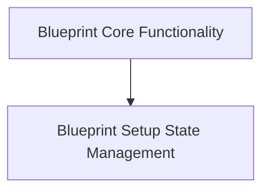

# Blueprint Core Module

The `blueprint_core` module, part of the `flask_sansio.blueprints` package, is fundamental to Flask's modular application structure. It provides the foundational classes for defining and managing blueprints, which are collections of routes, views, and other application components that can be registered on a Flask application.

## Architecture Overview

This module primarily consists of two key components: `Blueprint` and `BlueprintSetupState`. The `Blueprint` class serves as the main entry point for defining modular application sections, allowing developers to organize their application into reusable components. The `BlueprintSetupState` class acts as a temporary context during the registration of a blueprint to a Flask application, facilitating the correct configuration and integration of the blueprint's defined elements.

<!-- DIAGRAM_JSON
{
    "direction": "TD",
    "nodes": [
        {"id": "blueprint_main", "label": "Blueprint Core Functionality", "type": "module", "link": "blueprint_main.md"},
        {"id": "blueprint_setup_state", "label": "Blueprint Setup State Management", "type": "module", "link": "blueprint_setup_state.md"}
    ],
    "edges": [
        {"source": "blueprint_main", "target": "blueprint_setup_state", "label": "uses"}
    ],
    "groups": []
}
-->

## Sub-modules

### [Blueprint Core Functionality](blueprint_main.md)
This sub-module encapsulates the `Blueprint` class, which allows developers to define modular application sections. It handles the registration of routes, error handlers, and other application-specific configurations that can be applied to a Flask application.

### [Blueprint Setup State Management](blueprint_setup_state.md)
This sub-module contains the `BlueprintSetupState` class, responsible for managing the temporary state during the registration process of a blueprint to a Flask application. It ensures that all blueprint configurations, such as URL prefixes and subdomains, are correctly applied.