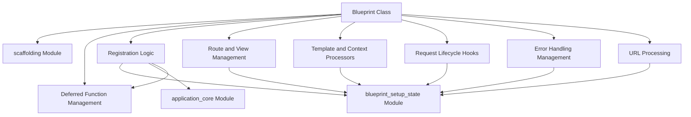

# `blueprint_main` Module Documentation

## Introduction

The `blueprint_main` module, represented by the `Blueprint` class within `src/flask/sansio/blueprints.py`, provides a powerful mechanism for organizing application components in Flask. Blueprints allow you to define application features such as routes, static files, and templates in a modular and reusable way, which can then be registered on a Flask application instance.

This module is part of the `flask_sansio` package, which implements Flask's core functionality using a sans-IO (input/output) approach, making it suitable for various ASGI servers and asynchronous applications.

## Architecture and Component Relationships

The `Blueprint` class acts as a container for application logic, deferring its registration until an application instance is available. It builds upon the `Scaffold` class for basic resource management and interacts extensively with `BlueprintSetupState` during the registration process to integrate its components into a `App` instance.

<!-- DIAGRAM_JSON
{
    "direction": "TD",
    "nodes": [
        {"id": "blueprint_class", "label": "Blueprint Class", "type": "component", "link": null},
        {"id": "scaffold_module", "label": "scaffolding Module", "type": "external", "link": "scaffolding.md"},
        {"id": "blueprint_setup_state_module", "label": "blueprint_setup_state Module", "type": "external", "link": "blueprint_setup_state.md"},
        {"id": "application_core_module", "label": "application_core Module", "type": "external", "link": "application_core.md"},
        {"id": "deferred_function_management", "label": "Deferred Function Management", "type": "component", "link": null},
        {"id": "registration_logic", "label": "Registration Logic", "type": "component", "link": null},
        {"id": "route_and_view_management", "label": "Route and View Management", "type": "component", "link": null},
        {"id": "template_and_context_processors", "label": "Template and Context Processors", "type": "component", "link": null},
        {"id": "request_lifecycle_hooks", "label": "Request Lifecycle Hooks", "type": "component", "link": null},
        {"id": "error_handling_management", "label": "Error Handling Management", "type": "component", "link": null},
        {"id": "url_processing", "label": "URL Processing", "type": "component", "link": null}
    ],
    "edges": [
        {"source": "blueprint_class", "target": "scaffold_module"},
        {"source": "blueprint_class", "target": "deferred_function_management"},
        {"source": "blueprint_class", "target": "registration_logic"},
        {"source": "blueprint_class", "target": "route_and_view_management"},
        {"source": "blueprint_class", "target": "template_and_context_processors"},
        {"source": "blueprint_class", "target": "request_lifecycle_hooks"},
        {"source": "blueprint_class", "target": "error_handling_management"},
        {"source": "blueprint_class", "target": "url_processing"},
        {"source": "registration_logic", "target": "blueprint_setup_state_module"},
        {"source": "registration_logic", "target": "application_core_module"},
        {"source": "registration_logic", "target": "deferred_function_management"},
        {"source": "route_and_view_management", "target": "blueprint_setup_state_module"},
        {"source": "template_and_context_processors", "target": "blueprint_setup_state_module"},
        {"source": "request_lifecycle_hooks", "target": "blueprint_setup_state_module"},
        {"source": "error_handling_management", "target": "blueprint_setup_state_module"},
        {"source": "url_processing", "target": "blueprint_setup_state_module"}
    ],
    "groups": []
}
-->

## Core Functionality

The `Blueprint` class extends `Scaffold` and provides the following core functionalities:

*   **Initialization**: A blueprint is initialized with a `name`, `import_name`, and optional parameters for static files, templates, URL prefixes, subdomains, and URL defaults.

*   **Deferred Functions (`record`, `record_once`)**: These methods allow registering functions that will be executed when the blueprint is registered with an application. This enables dynamic setup and configuration.

*   **Setup State (`make_setup_state`)**: Creates a `BlueprintSetupState` object, which encapsulates the current registration context, including the application instance and registration options. This state is passed to deferred functions.

*   **Blueprint Registration (`register_blueprint`, `register`)**: Blueprints can be nested within other blueprints or registered directly with a Flask `App` instance. The `register` method handles the complex process of merging the blueprint's routes, error handlers, request callbacks, and template processors into the main application. It also manages blueprint naming and URL prefixing to avoid conflicts.

*   **URL Rule Management (`add_url_rule`)**: Provides a mechanism to register URL rules (routes) that are automatically prefixed with the blueprint's configured URL prefix and name.

*   **Application-wide Decorators**: The blueprint offers decorators and methods to register application-wide template filters, tests, globals, request lifecycle hooks (`before_app_request`, `after_app_request`, `teardown_app_request`), context processors (`app_context_processor`), error handlers (`app_errorhandler`), and URL value preprocessors and defaults (`app_url_value_preprocessor`, `app_url_defaults`). These functionalities are applied to the parent application during blueprint registration.

## How it Fits into the Overall System

The `blueprint_main` module, through its `Blueprint` class, is a cornerstone of modular application development within the `flask_sansio` framework. It enables developers to:

*   **Organize Code**: Break down large applications into smaller, manageable, and reusable components.
*   **Promote Reusability**: Blueprints can be shared across different projects or within different parts of the same application.
*   **Encapsulate Functionality**: Each blueprint can encapsulate its own templates, static files, views, and error handlers, minimizing global namespace pollution.
*   **Scale Applications**: Facilitates the development of larger applications by providing a clear structure for managing diverse features.

When a `Blueprint` is registered with a `sansio.app.App` instance, it effectively extends the application's capabilities by integrating its defined routes, static files, templates, and event handlers. This dynamic integration allows for flexible and extensible application architectures. Its reliance on `blueprint_setup_state` ensures that all registered functions and configurations are applied correctly and consistently to the `App` during the setup phase.