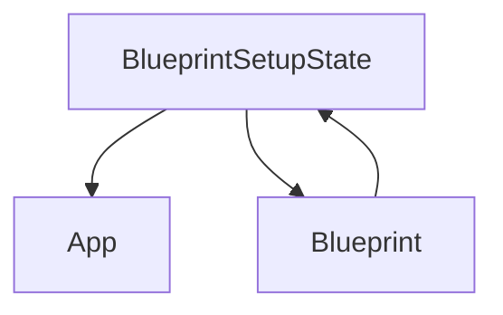

# `blueprint_setup_state` Module Documentation

## Introduction

The `blueprint_setup_state` module, part of the `flask_sansio` package, defines the `BlueprintSetupState` class. This class acts as a temporary holder object specifically designed to facilitate the registration of a blueprint with a Flask application. It encapsulates all the necessary state and options required during the setup process, ensuring that blueprints are registered consistently and correctly within the application context.

## Core Functionality

The primary component of this module is the `BlueprintSetupState` class.

### `BlueprintSetupState` Class

**Purpose**: The `BlueprintSetupState` class is instantiated by a [Blueprint](blueprint_main.md) during its registration with an application. It collects and manages configuration details such as URL prefixes, subdomains, and registration options, making them available to the blueprint's registration callbacks.

**Attributes**:

*   `app`: A reference to the current application instance ([application_core.md](application_core.md)).
*   `blueprint`: A reference to the [Blueprint](blueprint_main.md) object that initiated this setup state.
*   `options`: A dictionary containing all configuration options passed to the `Flask.register_blueprint` method.
*   `first_registration`: A boolean flag indicating whether this is the first time the blueprint is being registered with the application. This is useful for preventing redundant registrations of certain components.
*   `subdomain`: The resolved subdomain under which the blueprint's routes will be active. It is derived from either the options passed during registration or the blueprint's default subdomain.
*   `url_prefix`: The resolved URL prefix that will be prepended to all URLs defined within this blueprint. Similar to `subdomain`, it can be specified during registration or defaults to the blueprint's own prefix.
*   `name`: The name assigned to the blueprint, potentially overridden by registration options.
*   `name_prefix`: An optional prefix for the blueprint's name, primarily used for internal endpoint naming.
*   `url_defaults`: A dictionary of default URL values that are automatically added to every URL rule defined within the blueprint.

**Methods**:

*   `add_url_rule(self, rule, endpoint=None, view_func=None, **options)`:
    *   A utility method for registering a URL rule and an optional view function to the application.
    *   It automatically handles the application of `url_prefix`, `subdomain`, and `url_defaults` based on the `BlueprintSetupState`'s configured values.
    *   The `endpoint` for the rule is automatically prefixed with the blueprint's name to ensure uniqueness across the application.
    *   Internally, this method delegates the actual rule registration to `self.app.add_url_rule()`.

## Architecture and Component Relationships

The `BlueprintSetupState` serves as a critical intermediary during blueprint registration. It is created by a `Blueprint` instance and passed to the application's registration mechanism. It holds the context for how the blueprint should be integrated into the application's routing and configuration.

<!-- DIAGRAM_JSON
{
    "direction": "TD",
    "nodes": [
        {"id": "blueprint_setup_state_component", "label": "BlueprintSetupState", "type": "component", "link": null},
        {"id": "blueprint_main", "label": "Blueprint", "type": "external", "link": "blueprint_main.md"},
        {"id": "application_core", "label": "App", "type": "external", "link": "application_core.md"}
    ],
    "edges": [
        {"source": "blueprint_main", "target": "blueprint_setup_state_component"},
        {"source": "blueprint_setup_state_component", "target": "application_core"},
        {"source": "blueprint_setup_state_component", "target": "blueprint_main"}
    ],
    "groups": []
}
-->

## How it Fits into the Overall System

In the `flask_sansio` framework, the `BlueprintSetupState` plays a pivotal role in the modular organization of applications. When a developer calls `app.register_blueprint(blueprint_instance)`, the `Blueprint` object first creates a `BlueprintSetupState` instance. This state object then guides the process of adding routes, static files, and error handlers defined within the blueprint to the main [application_core.md](application_core.md) instance. It ensures that all blueprint-specific configurations (like `url_prefix` and `subdomain`) are correctly applied and that blueprint components are registered with the application in a consistent and encapsulated manner, promoting reusability and maintainability of codebases.
