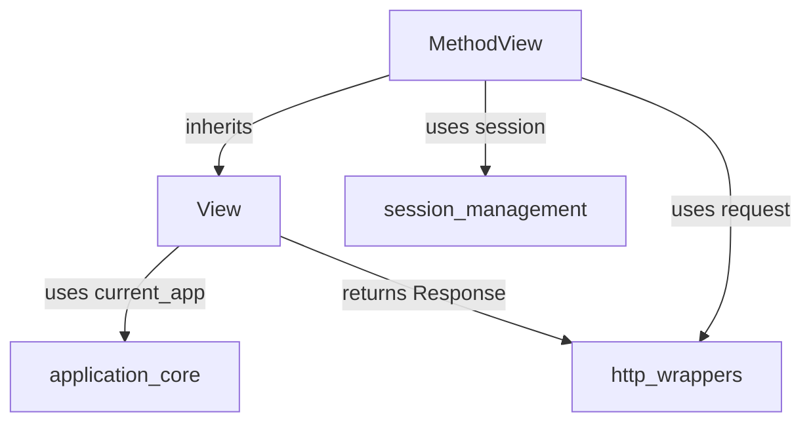

# class_based_views

This module provides the foundation for creating class-based views in Flask, offering a more structured approach to defining request handlers compared to traditional function-based views. It includes the base `View` class for generic views and the `MethodView` for dispatching requests based on HTTP methods.

## Comprehensive Documentation

### 1. `View` Class
*   **Purpose:** The base class for all class-based views. It allows developers to define view logic within a class, making code more organized and reusable.
*   **Core Functionality:**
    *   `dispatch_request()`: An abstract method that subclasses *must* override. This method contains the actual logic for handling a request and should return a valid Flask response.
    *   `as_view(name, *class_args, **class_kwargs)`: A class method that converts the `View` subclass into a callable view function suitable for registration with Flask's routing system (`app.add_url_rule`). It handles instance creation and calling `dispatch_request`.
*   **Key Attributes:**
    *   `methods`: (ClassVar) Specifies the HTTP methods the view will accept (e.g., `["GET", "POST"]`). Defaults to `["GET", "HEAD", "OPTIONS"]`.
    *   `provide_automatic_options`: (ClassVar) Controls whether Flask automatically handles `OPTIONS` requests. Defaults to `True`.
    *   `decorators`: (ClassVar) A list of decorators to apply to the generated view function. Useful for authentication, caching, etc.
    *   `init_every_request`: (ClassVar) Determines whether a new instance of the view class is created for every request (`True` by default) or if a single instance is reused (`False`). Setting to `False` can improve efficiency but requires careful handling of request-specific data.
*   **Usage:** Inherit from `View`, override `dispatch_request`, and register the view using `YourViewClass.as_view('endpoint_name')`.

### 2. `MethodView` Class
*   **Purpose:** Extends `View` to provide a convenient way to define RESTful APIs or views where different HTTP methods require distinct handling logic.
*   **Core Functionality:**
    *   Automatically dispatches incoming requests to instance methods named after the HTTP method (e.g., a `GET` request calls `self.get()`, a `POST` request calls `self.post()`).
    *   Automatically infers the `methods` attribute from the `get`, `post`, `put`, `delete`, etc., methods defined within the class.
    *   Handles `HEAD` requests by falling back to the `get()` method if no specific `head()` method is defined.
*   **Inheritance:** `MethodView` inherits from `View`.
*   **Usage:** Inherit from `MethodView` and define methods like `get(self, ...)` and `post(self, ...)` to handle respective HTTP requests.

### 3. Architecture and Component Relationships

The `class_based_views` module is a fundamental part of the `view_handling` component within the `app_core` of Flask. It provides an object-oriented approach to structuring application logic for routes.

*   `View` serves as the abstract base for all class-based views, defining common attributes and the mechanism (`as_view`) to convert a class into a callable Flask view.
*   `MethodView` builds upon `View`, providing a specialized pattern for handling different HTTP methods through corresponding instance methods. This promotes cleaner, more organized code for RESTful endpoints.

Both `View` and `MethodView` rely on Flask's request context, specifically the global `request` object for method inspection and URL arguments, and the `current_app` proxy for application-specific operations (e.g., `ensure_sync`). `MethodView` also demonstrates interaction with the `session` object for state management.

<!-- DIAGRAM_JSON
{
    "direction": "TD",
    "nodes": [
        {"id": "view_class", "label": "View", "type": "component", "link": null},
        {"id": "method_view_class", "label": "MethodView", "type": "component", "link": null},
        {"id": "application_core_module", "label": "application_core", "type": "external", "link": "application_core.md"},
        {"id": "http_wrappers_module", "label": "http_wrappers", "type": "external", "link": "http_wrappers.md"},
        {"id": "session_management_module", "label": "session_management", "type": "external", "link": "session_management.md"}
    ],
    "edges": [
        {"source": "method_view_class", "target": "view_class", "label": "inherits"},
        {"source": "view_class", "target": "application_core_module", "label": "uses current_app"},
        {"source": "view_class", "target": "http_wrappers_module", "label": "returns Response"},
        {"source": "method_view_class", "target": "http_wrappers_module", "label": "uses request"},
        {"source": "method_view_class", "target": "session_management_module", "label": "uses session"}
    ],
    "groups": []
}
-->

### 4. How the Module Fits into the Overall System

The `class_based_views` module provides a core abstraction layer for handling HTTP requests in a Flask application in an object-oriented manner. It resides within the `view_handling` component, which is responsible for defining how routes map to executable code.

*   It integrates directly with Flask's routing system, allowing instances of `View` or `MethodView` subclasses to be registered as endpoint handlers.
*   It leverages components from [application_core](application_core.md) (e.g., `current_app`) for application context and [http_wrappers](http_wrappers.md) (e.g., `request`, `Response`) for handling incoming request data and outgoing responses.
*   For stateful operations, especially with `MethodView`, it can interact with [session_management](session_management.md) to access and modify user session data.

By centralizing view logic within classes, this module promotes code reusability, testability, and adherence to principles like DRY (Don't Repeat Yourself), particularly beneficial in larger Flask applications or when building RESTful APIs.
