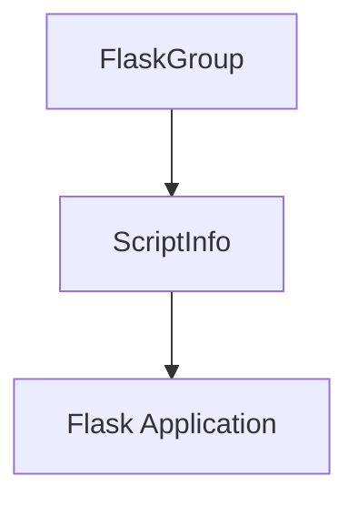

# CLI Application Info Module

The `cli_application_info` module is a crucial part of Flask's command-line interface (CLI), primarily housing the `ScriptInfo` class. This module acts as a central hub for managing and loading Flask application instances within the CLI environment, enabling various CLI commands to interact with a specific Flask application.

## Core Functionality

### `ScriptInfo` Class

The `ScriptInfo` class (defined in `src.flask.cli.ScriptInfo`) is a helper object designed to encapsulate information needed to locate and load a Flask application. It's typically used internally by Flask's CLI dispatching mechanism, especially by command groups like `FlaskGroup`, but can also be manually instantiated.

**Key Attributes:**

*   `app_import_path` (str | None): An optional import path string (e.g., "my_app:create_app") that specifies how to find the Flask application.
*   `create_app` (Callable[..., Flask] | None): An optional callable that, when invoked, returns an instance of the Flask application. This provides a programmatic way to load the app.
*   `data` (dict[Any, Any]): A dictionary for storing arbitrary data associated with the script information, allowing for flexible extensions.
*   `set_debug_flag` (bool): A flag indicating whether the application's debug mode should be updated based on the CLI environment.
*   `load_dotenv_defaults` (bool): Specifies whether default `.flaskenv` and `.env` files should be considered when loading environment variables.

**Key Method:**

*   `load_app()`: This method is responsible for loading the Flask application instance. It first checks if the application has already been loaded (`_loaded_app`). If not, it attempts to load the app using the `create_app` callable or by dynamically importing it via `app_import_path`. If no path or callable is provided, it tries to locate common application files like `wsgi.py` or `app.py`. Upon successful loading, it may update the application's debug flag and then caches the loaded app for future calls. If no application can be found, it raises a `NoAppException`.

## Architecture and Component Relationships

The `cli_application_info` module, through its `ScriptInfo` component, serves as an intermediary between Flask CLI commands and the actual Flask application instance. It is essential for command groups like `FlaskGroup` to get a hold of the application context before executing commands.

<!-- DIAGRAM_JSON
{
    "direction": "TD",
    "nodes": [
        {"id": "script_info", "label": "ScriptInfo", "type": "component", "link": null},
        {"id": "flask_app", "label": "Flask Application", "type": "external", "link": "flask_application_core.md"},
        {"id": "flask_group", "label": "FlaskGroup", "type": "external", "link": "flask_group_cli.md"}
    ],
    "edges": [
        {"source": "flask_group", "target": "script_info"},
        {"source": "script_info", "target": "flask_app"}
    ],
    "groups": []
}
-->

**Diagram Explanation:**

*   **`ScriptInfo` (Component):** Represents the core `ScriptInfo` class within this module, responsible for managing application loading.
*   **`FlaskGroup` (External):** A command group from the [flask_group_cli module](flask_group_cli.md) that utilizes `ScriptInfo` to interact with and manage a Flask application through CLI commands.
*   **`Flask Application` (External):** The actual Flask application instance, defined in the [flask_application_core module](flask_application_core.md), which `ScriptInfo` is designed to locate and load.

## How the Module Fits into the Overall System

The `cli_application_info` module is a fundamental building block for the Flask CLI. It decouples the mechanism of locating and loading a Flask application from the execution logic of individual CLI commands. This separation ensures that commands can reliably obtain an application instance, whether it's specified via an environment variable (`FLASK_APP`), a command-line option (`--app`), or convention (e.g., `app.py`).

By providing a standardized way to load the application, `ScriptInfo` facilitates:
*   **Consistent Application Context:** Ensures that all CLI commands operate within the correct Flask application context.
*   **Flexibility in App Loading:** Supports various methods for defining and discovering the Flask application.
*   **Debugging and Development:** Allows for programmatic control over the debug flag during development via the CLI.

It integrates deeply with `FlaskGroup` (from [flask_group_cli](flask_group_cli.md)) and ultimately provides the necessary `Flask` instance (from [flask_application_core](flask_application_core.md)) for CLI operations to proceed.

