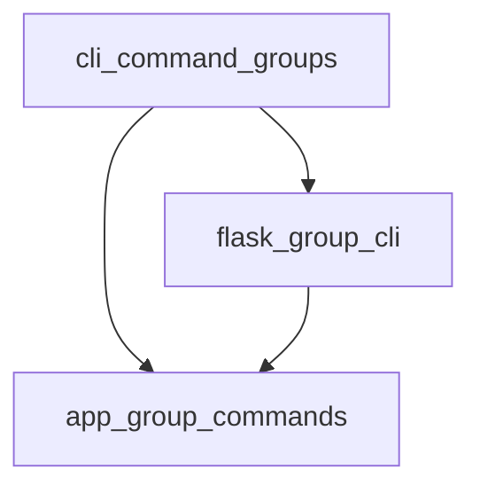

# CLI Command Groups

The `cli_command_groups` module is a core component within Flask's command-line interface (CLI) system. It provides specialized command groups that extend the functionality of the [Click](https://click.palletsprojects.com/) library, enabling Flask applications to define and manage their own CLI commands effectively.

This module is crucial for tasks such as running development servers, interacting with the application shell, and executing custom commands defined within a Flask application. It builds upon the [cli_core.md](cli_core.md) module, leveraging its foundational structures for CLI management.

## Architecture

The `cli_command_groups` module consists of two primary command group classes:

<!-- DIAGRAM_JSON
{
    "direction": "TD",
    "nodes": [
        {"id": "app_group_commands", "label": "App Group Commands", "type": "module", "link": "app_group_commands.md"},
        {"id": "flask_group_cli", "label": "Flask Group CLI", "type": "module", "link": "flask_group_cli.md"}
    ],
    "edges": [
        {"source": "flask_group_cli", "target": "app_group_commands"}
    ],
    "groups": []
}
-->

## Sub-modules

Here's a brief overview of the sub-modules within `cli_command_groups`:

*   ### [App Group Commands](app_group_commands.md)

    The `app_group_commands` sub-module defines `AppGroup`, a Click Group subclass that automatically wraps command functions with the application context. This ensures that CLI commands have access to the Flask application's configuration and resources.

*   ### [Flask Group CLI](flask_group_cli.md)

    The `flask_group_cli` sub-module introduces `FlaskGroup`, a specialized `AppGroup` that integrates directly with Flask applications. It enables loading commands from the configured Flask app, handles environment variable loading (e.g., from `.env` files), and provides default commands like `run` and `shell`.