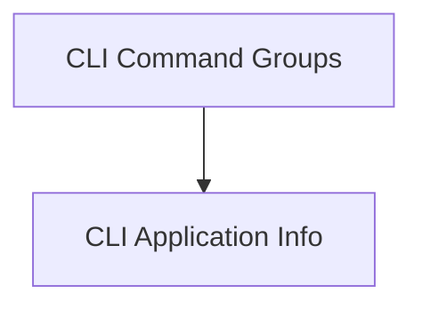

# CLI Core Module Documentation

## Introduction and Purpose

The `cli_core` module in Flask provides the foundational components for building command-line interfaces (CLIs) for Flask applications. It integrates with the Click library to offer a robust and extensible way to define and manage CLI commands, ensuring proper application context and environment setup. This module is essential for creating powerful and user-friendly command-line tools that interact seamlessly with Flask applications.

## Architecture Overview

The `cli_core` module is structured into two main sub-modules: `cli_application_info` and `cli_command_groups`.

The `cli_application_info` module is responsible for abstracting the details of loading a Flask application within a CLI environment. This ensures that CLI commands have access to a properly configured Flask application instance.

The `cli_command_groups` module builds upon Click's group functionality to provide specialized command groups (`AppGroup` and `FlaskGroup`) that automatically handle Flask's application context. These groups enable the dynamic loading of commands defined within a Flask application, making it easy to extend the CLI with custom functionalities. The `FlaskGroup` specifically leverages the `ScriptInfo` component from the `cli_application_info` module to manage the application loading process, creating a cohesive system for CLI management.

<!-- DIAGRAM_JSON
{
    "direction": "TD",
    "nodes": [
        {"id": "cli_application_info", "label": "CLI Application Info", "type": "module", "link": "cli_application_info.md"},
        {"id": "cli_command_groups", "label": "CLI Command Groups", "type": "module", "link": "cli_command_groups.md"}
    ],
    "edges": [
        {"source": "cli_command_groups", "target": "cli_application_info"}
    ],
    "groups": []
}
-->

## Sub-modules

### [CLI Application Info](cli_application_info.md)
This sub-module focuses on managing the loading and access of Flask application instances within a command-line interface context. It encapsulates the logic for locating and initializing a Flask application, making it available to CLI commands.

### [CLI Command Groups](cli_command_groups.md)
This sub-module provides specialized extensions of Click's command group classes. These extensions facilitate the creation of Flask-specific CLI command groups that automatically push application contexts and dynamically discover commands defined within the Flask application itself.
