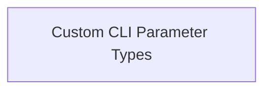

# cli_parameter_types Module Documentation

## Introduction

The `cli_parameter_types` module within Flask's CLI tooling provides custom Click parameter types to enhance command-line argument handling. It extends Click's functionality to support specific argument formats, such as lists of paths and flexible SSL certificate specifications. This module is a child of the `cli_parameters` module, which is part of the broader `flask_cli` ecosystem.

## Architecture Overview

The `cli_parameter_types` module is designed to integrate seamlessly with Click, a popular Python package for creating command-line interfaces. It defines specialized parameter types that validate and transform command-line input, ensuring robustness and ease of use for Flask's CLI commands.

This module contains one primary sub-module:

*   **Custom CLI Parameter Types** (`custom_cli_types.md`): Handles the definition and conversion logic for custom CLI parameter types.

<!-- DIAGRAM_JSON
{
    "direction": "TD",
    "nodes": [
        {"id": "custom_cli_types", "label": "Custom CLI Parameter Types", "type": "module", "link": "custom_cli_types.md"}
    ],
    "edges": [],
    "groups": []
}
-->
