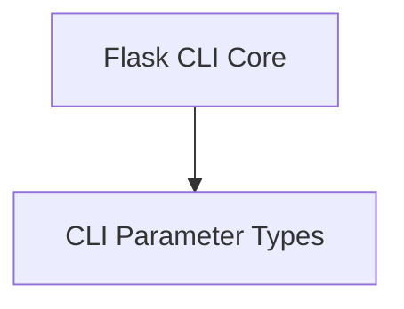

# CLI Parameters Module

## Introduction

The `cli_parameters` module in Flask is responsible for defining custom parameter types used in Flask's command-line interface (CLI). These custom types enhance the functionality and validation of command-line arguments, ensuring robust and flexible CLI commands.

## Architecture

The `cli_parameters` module primarily consists of custom `click.ParamType` subclasses. These classes integrate with the [flask_cli](flask_cli.md) module to provide specialized input handling for various command-line options.

<!-- DIAGRAM_JSON
{
    "direction": "TD",
    "nodes": [
        {"id": "cli_parameter_types", "label": "CLI Parameter Types", "type": "module", "link": "cli_parameter_types.md"},
        {"id": "flask_cli", "label": "Flask CLI Core", "type": "external", "link": "flask_cli.md"}
    ],
    "edges": [
        {"source": "flask_cli", "target": "cli_parameter_types"}
    ],
    "groups": []
}
-->

## Sub-modules

### CLI Parameter Types (`cli_parameter_types.md`)
This sub-module defines custom Click parameter types. It includes:
- `SeparatedPathType`: A parameter type that accepts a list of values separated by the OS's path separator, with each value validated as a `click.Path`.
- `CertParamType`: A parameter type for handling SSL certificate paths, supporting existing files, the string 'adhoc' for ad-hoc certificates, or an importable `ssl.SSLContext` object.
