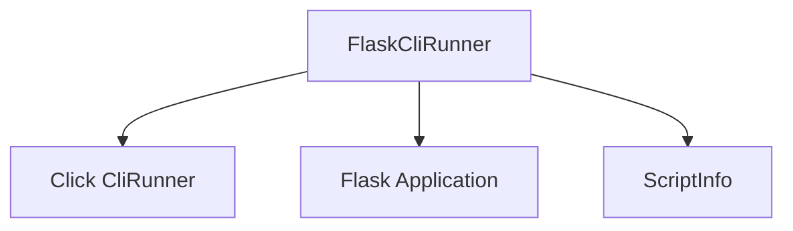

# `cli_testing` Module Documentation

## Introduction

The `cli_testing` module provides tools for testing Flask's command-line interface (CLI) commands. Its primary component, `FlaskCliRunner`, extends Click's `CliRunner` to seamlessly integrate with Flask applications, allowing developers to test CLI functionalities in an isolated environment.

## Core Functionality

The `cli_testing` module focuses on enabling robust testing of Flask CLI commands. The `FlaskCliRunner` facilitates the invocation of these commands, automatically handling the necessary Flask application context and `ScriptInfo` setup.

## Architecture and Component Relationships

The `cli_testing` module contains the `FlaskCliRunner` component, which is a specialized runner for Flask CLI tests. It builds upon Click's `CliRunner` and interacts with the core Flask application and its CLI utilities.

<!-- DIAGRAM_JSON
{
    "direction": "TD",
    "nodes": [
        {"id": "flask_cli_runner", "label": "FlaskCliRunner", "type": "component", "link": null},
        {"id": "flask_app", "label": "Flask Application", "type": "external", "link": "flask_application_core.md"},
        {"id": "script_info", "label": "ScriptInfo", "type": "external", "link": "flask_cli.md"},
        {"id": "cli_runner", "label": "Click CliRunner", "type": "external", "link": "https://click.palletsprojects.com/en/8.1.x/testing/"}
    ],
    "edges": [
        {"source": "flask_cli_runner", "target": "cli_runner"},
        {"source": "flask_cli_runner", "target": "flask_app"},
        {"source": "flask_cli_runner", "target": "script_info"}
    ],
    "groups": []
}
-->

### `FlaskCliRunner`

`FlaskCliRunner` is a specialized `CliRunner` from the Click testing suite, designed to work with Flask applications. It is typically instantiated via `Flask.test_cli_runner()`.

-   **Purpose**: Provides an isolated environment to invoke Flask CLI commands and capture their output and exit codes.
-   **Initialization (`__init__`)**:
    -   Takes a Flask application instance (`app`) during initialization, which it uses to locate the application's CLI group and set up the `ScriptInfo` object.
-   **Invocation (`invoke`)**:
    -   Extends the base `CliRunner.invoke` method.
    -   If no `cli` object is provided, it defaults to the Flask application's `app.cli` group.
    -   Automatically injects an instance of `ScriptInfo` into the Click context, configured to load the Flask application being tested. This ensures that CLI commands have access to the correct application context during testing.

## Integration with the Overall System

The `cli_testing` module is a crucial part of the larger `flask_testing` ecosystem, which provides comprehensive tools for testing Flask applications. It works in conjunction with the main [flask_application_core.md](flask_application_core.md) module by interacting directly with the `Flask` application object. It also relies on components from the [flask_cli.md](flask_cli.md) module, specifically `ScriptInfo`, to correctly set up the environment for CLI command execution during tests. This module ensures that developers can thoroughly test custom CLI commands defined within their Flask applications, contributing to the overall reliability and maintainability of Flask projects.
