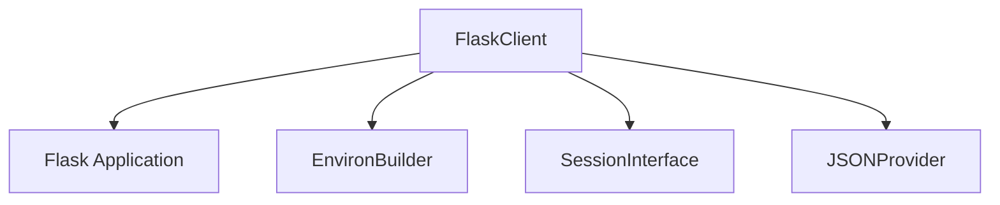

# client_testing Module Documentation

The `client_testing` module provides the `FlaskClient`, a specialized test client designed for Flask applications. It extends the standard Werkzeug test client with Flask-specific functionalities, enabling robust and efficient testing of Flask applications by simulating HTTP requests and managing application contexts and sessions within a testing environment.

## Architecture and Component Relationships

The `client_testing` module's core component, `FlaskClient`, is instrumental in simulating requests to a Flask application. It interacts closely with various Flask core components to provide a comprehensive testing experience.

`FlaskClient` builds upon Werkzeug's `Client` to offer additional capabilities such as:
- **Context Preservation**: It can defer the cleanup of the request context until the end of a `with` block, which is crucial for tests that need to inspect the application state after a request.
- **Session Transactions**: Provides a context manager (`session_transaction`) to inspect and modify the session used by the test client, allowing for direct manipulation of session data during tests.
- **Environment Management**: Initializes a base environment (`environ_base`) with common testing values like `REMOTE_ADDR` and `HTTP_USER_AGENT`.
- **Request Building**: Utilizes the `EnvironBuilder` from the `environment_builder` module to construct WSGI environments and requests, ensuring proper setup for each test request.
- **JSON Handling**: Integrates with Flask's JSON provider to handle JSON responses, making it easier to test API endpoints.

### Module Diagram

<!-- DIAGRAM_JSON
{
    "direction": "TD",
    "nodes": [
        {"id": "flask_client", "label": "FlaskClient", "type": "component", "link": null},
        {"id": "flask_app", "label": "Flask Application", "type": "external", "link": "flask_application_core.md"},
        {"id": "environ_builder", "label": "EnvironBuilder", "type": "external", "link": "environment_builder.md"},
        {"id": "session_interface", "label": "SessionInterface", "type": "external", "link": "flask_application_core.md"},
        {"id": "json_provider", "label": "JSONProvider", "type": "external", "link": "flask_json.md"}
    ],
    "edges": [
        {"source": "flask_client", "target": "flask_app"},
        {"source": "flask_client", "target": "environ_builder"},
        {"source": "flask_client", "target": "session_interface"},
        {"source": "flask_client", "target": "json_provider"}
    ],
    "groups": []
}
-->

## How the Module Fits into the Overall System

The `client_testing` module is a fundamental part of the `flask_testing` ecosystem. It provides the primary mechanism for simulating web requests against a Flask application during testing. By offering a high-level API for making requests, managing sessions, and interacting with application contexts, it greatly simplifies the process of writing integration and functional tests.

Developers use `FlaskClient` to:
- **Send HTTP requests**: Simulate GET, POST, PUT, DELETE, etc., requests to application endpoints.
- **Test request/response cycles**: Verify the behavior of routes, view functions, and error handlers.
- **Manipulate sessions**: Directly inspect and modify session data to test authentication, user preferences, and other session-dependent features.
- **Control context**: Ensure that requests are processed within the correct application and request contexts, allowing for realistic testing scenarios.

This module, therefore, is essential for ensuring the quality and correctness of Flask applications by providing a reliable and Flask-aware testing client.