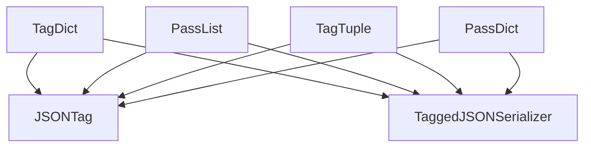

# container_type_tags Module Documentation

## Introduction

The `container_type_tags` module is a crucial part of Flask's JSON serialization mechanism, specifically designed to handle common Python container types such as dictionaries and lists. This module defines various `JSONTag` implementations that enable the `TaggedJSONSerializer` to correctly serialize and deserialize these container types, preserving their structure and ensuring that any embedded taggable values are also processed.

It works in conjunction with the [base_tagging](base_tagging.md) module, which provides the foundational `JSONTag` class, and contributes to the overall functionality of the [json_tagging](json_tagging.md) and [flask_json](flask_json.md) modules.

## Core Functionality and Components

The `container_type_tags` module provides specialized `JSONTag` implementations for different container types:

### `TagDict`

-   **Purpose**: Handles the serialization and deserialization of single-item dictionaries where the key itself matches a registered tag. This allows for specialized handling of specific tagged objects wrapped within a dictionary.
-   **Mechanism**: When serializing, it appends `__` to the dictionary key. During deserialization, it removes this suffix to reconstruct the original key.
-   **Inheritance**: Extends `JSONTag` from [base_tagging](base_tagging.md).

### `PassDict`

-   **Purpose**: Provides a mechanism to serialize and deserialize general dictionaries. Unlike `TagDict`, it processes all key-value pairs within the dictionary, applying the serializer's tagging logic to each value.
-   **Mechanism**: Iterates through the dictionary items and recursively calls `self.serializer.tag()` on each value. Keys are not tagged as JSON objects only allow string keys.
-   **Inheritance**: Extends `JSONTag` from [base_tagging](base_tagging.md).

### `PassList`

-   **Purpose**: Designed for serializing and deserializing standard Python lists. It ensures that all elements within a list are properly processed by the `TaggedJSONSerializer`.
-   **Mechanism**: Iterates through the list elements and recursively calls `self.serializer.tag()` on each item.
-   **Inheritance**: Extends `JSONTag` from [base_tagging](base_tagging.md).

### `TagTuple`

-   **Purpose**: Handles the serialization and deserialization of Python tuples. It converts tuples into a list for JSON representation and then back into a tuple during deserialization.
-   **Mechanism**: Converts the tuple to a list during serialization, applying `self.serializer.tag()` to each element. During deserialization, it converts the processed list back into a tuple.
-   **Inheritance**: Extends `JSONTag` from [base_tagging](base_tagging.md).

## Architecture and Component Relationships

The following diagram illustrates the internal components of the `container_type_tags` module and its dependencies on external modules like `base_tagging` for its base class `JSONTag` and `serializer_core` for the `TaggedJSONSerializer` which is used for recursive tagging.

<!-- DIAGRAM_JSON
{
    "direction": "TD",
    "nodes": [
        {"id": "tag_dict", "label": "TagDict", "type": "component", "link": null},
        {"id": "pass_list", "label": "PassList", "type": "component", "link": null},
        {"id": "tag_tuple", "label": "TagTuple", "type": "component", "link": null},
        {"id": "pass_dict", "label": "PassDict", "type": "component", "link": null},
        {"id": "json_tag", "label": "JSONTag", "type": "external", "link": "base_tagging.md"},
        {"id": "tagged_json_serializer", "label": "TaggedJSONSerializer", "type": "external", "link": "serializer_core.md"}
    ],
    "edges": [
        {"source": "tag_dict", "target": "json_tag"},
        {"source": "tag_dict", "target": "tagged_json_serializer"},
        {"source": "pass_list", "target": "json_tag"},
        {"source": "pass_list", "target": "tagged_json_serializer"},
        {"source": "tag_tuple", "target": "json_tag"},
        {"source": "tag_tuple", "target": "tagged_json_serializer"},
        {"source": "pass_dict", "target": "json_tag"},
        {"source": "pass_dict", "target": "tagged_json_serializer"}
    ],
    "groups": []
}
-->

## How the Module Fits into the Overall System

The `container_type_tags` module is a specialized sub-module within `tag_definitions`, which itself is part of the broader `json_tagging` system in Flask. Its primary role is to extend the `TaggedJSONSerializer` capabilities by providing specific rules for handling Python's fundamental container types during JSON serialization and deserialization.

When Flask needs to serialize a complex Python object, the `TaggedJSONSerializer` (from [serializer_core](serializer_core.md)) uses the `JSONTag` instances registered with it to determine how to represent different data types. The tags defined in `container_type_tags` ensure that:

*   Lists (`PassList`) and tuples (`TagTuple`) are correctly processed element by element.
*   Dictionaries (`PassDict`) have their values recursively processed.
*   Specialized dictionaries (`TagDict`) that act as wrappers for tagged objects are handled with their specific tagging logic.

This ensures that nested structures within complex objects are properly converted to and from JSON, maintaining data integrity across the serialization boundary. It's a critical component for enabling Flask to handle rich data structures in a robust and extensible manner, especially when dealing with custom types that might embed or contain these standard Python containers. This module integrates seamlessly with the JSON providers in [json_providers](json_providers.md) to offer a complete JSON serialization solution for Flask applications.
