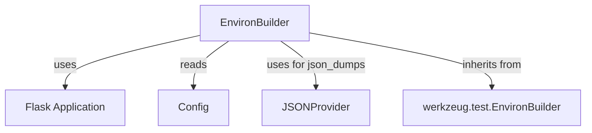

# environment_builder Module Documentation

## Introduction

The `environment_builder` module provides the `EnvironBuilder` class, which extends Werkzeug's `EnvironBuilder` to seamlessly integrate with a Flask application's configuration for creating test request environments. This module is a core part of Flask's testing utilities, enabling developers to simulate incoming requests with accurate application-specific settings.

## Comprehensive Documentation

### `EnvironBuilder` Class

`EnvironBuilder` is a specialized builder for creating WSGI environment dictionaries, which are used to simulate HTTP requests in a testing context. It simplifies the process by automatically pulling default values from a Flask application's configuration.

**Core Functionality:**

-   **Application-Aware Environment Building:** Automatically uses the `Flask` application's `SERVER_NAME`, `APPLICATION_ROOT`, and `PREFERRED_URL_SCHEME` to construct the `base_url` for test requests.
-   **JSON Serialization:** Provides a `json_dumps` method that leverages the application's configured JSON provider for consistent serialization of JSON data within test requests.

**Parameters:**

-   `app`: The `Flask` application instance from which configuration defaults (e.g., `SERVER_NAME`, `APPLICATION_ROOT`, `PREFERRED_URL_SCHEME`) are taken.
-   `path`: The URL path for the request, e.g., `/users/1`.
-   `base_url`: The base URL where the application is served. If not provided, it's constructed using the app's configuration and `subdomain`.
-   `subdomain`: An optional subdomain to append to the `SERVER_NAME` for the `base_url` construction.
-   `url_scheme`: The URL scheme (e.g., `http` or `https`) to use. If not provided, it defaults to the app's `PREFERRED_URL_SCHEME`.
-   `json`: Data to be serialized as JSON and passed as the request body. Automatically sets `content_type` to `application/json`.
-   `*args`, `**kwargs`: Additional positional and keyword arguments passed directly to the underlying `werkzeug.test.EnvironBuilder`.

### Usage Example

```python
from flask import Flask
from flask.testing import EnvironBuilder

app = Flask(__name__)
app.config['SERVER_NAME'] = 'example.com'
app.config['APPLICATION_ROOT'] = '/app'
app.config['PREFERRED_URL_SCHEME'] = 'https'

with app.test_request_context():
    builder = EnvironBuilder(app, path='/hello', subdomain='api', method='POST', json={'message': 'Hello'})
    environ = builder.get_environ()
    print(environ['REQUEST_URI'])
    print(environ['HTTP_HOST'])
    print(environ['wsgi.url_scheme'])
    print(environ['CONTENT_TYPE'])
    print(environ['wsgi.input'].read())
```

## Architecture and Component Relationships

The `EnvironBuilder` class acts as an adapter, integrating Werkzeug's generic environment building capabilities with Flask's application-specific settings. It primarily interacts with the Flask application's configuration and its JSON serialization utilities.

<!-- DIAGRAM_JSON
{
    "direction": "TD",
    "nodes": [
        {"id": "environ_builder", "label": "EnvironBuilder", "type": "component", "link": null},
        {"id": "flask_app", "label": "Flask Application", "type": "external", "link": "flask_application_core.md"},
        {"id": "flask_config", "label": "Config", "type": "external", "link": "flask_application_core.md"},
        {"id": "flask_json_provider", "label": "JSONProvider", "type": "external", "link": "flask_json.md"},
        {"id": "werkzeug_environbuilder", "label": "werkzeug.test.EnvironBuilder", "type": "external", "link": null}
    ],
    "edges": [
        {"source": "environ_builder", "target": "flask_app", "label": "uses"},
        {"source": "environ_builder", "target": "flask_config", "label": "reads"},
        {"source": "environ_builder", "target": "flask_json_provider", "label": "uses for json_dumps"},
        {"source": "environ_builder", "target": "werkzeug_environbuilder", "label": "inherits from"}
    ],
    "groups": []
}
-->


## How the Module Fits into the Overall System

The `environment_builder` module is a crucial part of the `flask_testing` package, specifically enabling the creation of detailed and configurable WSGI environments for testing Flask applications. It is often used internally by other testing utilities like `FlaskClient` to construct requests for unit and integration tests. By abstracting the complexities of WSGI environment creation and integrating with the Flask application's configuration, it ensures that tests accurately reflect how an application would behave under real-world request conditions. Its primary consumers are typically testing frameworks and developers writing custom test harnesses for Flask applications.