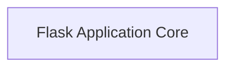

# Flask Application Core

Provides 23 component(s) for flask application core operations.

## Components

This module contains 23 component(s):

- `src.flask.app.Flask`
- `src.flask.blueprints.Blueprint`
- `src.flask.config.Config`
- `src.flask.config.ConfigAttribute`
- `src.flask.ctx.AppContext`
- `src.flask.ctx._AppCtxGlobals`
- `src.flask.globals.FlaskProxy`
- `src.flask.globals._AppCtxGlobalsProxy`
- `src.flask.globals.RequestProxy`
- `src.flask.globals.SessionMixinProxy`
- ... and 13 more

## Structure

---
*This documentation was auto-generated to ensure completeness.*
