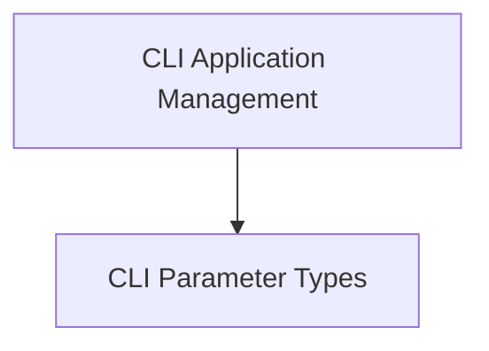

# Flask CLI Module Documentation

The `flask_cli` module provides the command-line interface (CLI) for Flask applications, enabling developers to run, manage, and interact with their applications through a terminal. It builds upon the Click library to offer a robust and extensible command-line experience, including features for loading applications, managing contexts, and defining custom commands.

## Architecture Overview

The `flask_cli` module is structured into core components that handle application loading, command registration, and custom parameter types. The primary interaction point for most users is the `FlaskGroup`, which orchestrates the command-line environment.

<!-- DIAGRAM_JSON
{
    "direction": "TD",
    "nodes": [
        {"id": "cli_core", "label": "CLI Application Management", "type": "module", "link": "cli_core.md"},
        {"id": "cli_parameters", "label": "CLI Parameter Types", "type": "module", "link": "cli_parameters.md"}
    ],
    "edges": [
        {"source": "cli_core", "target": "cli_parameters"}
    ],
    "groups": []
}
-->

## Sub-modules

### [CLI Application Management](cli_core.md)
This sub-module is responsible for the foundational aspects of the Flask CLI, including the loading of Flask applications, managing the application context for commands, and extending Click groups. It encompasses classes like `ScriptInfo`, `AppGroup`, and `FlaskGroup`, which are crucial for the CLI's operation.

### [CLI Parameter Types](cli_parameters.md)
This sub-module defines custom parameter types for Click commands, enhancing the flexibility and validation of command-line arguments. It includes types such as `SeparatedPathType` for handling lists of paths and `CertParamType` for processing SSL certificate specifications.