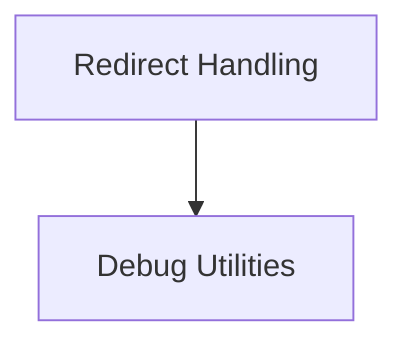

# Flask Debugging Module

The `flask_debugging` module provides a set of tools and helpers specifically designed to aid in debugging Flask applications. It focuses on identifying and preventing common issues that might arise during development, such as improper handling of redirects that could lead to data loss, and providing more informative error messages.

## Architecture Overview

The `flask_debugging` module is composed of several key sub-modules, each addressing a specific aspect of debugging within a Flask application. These components work together to provide developers with clearer insights into potential problems and guide them towards robust solutions.

<!-- DIAGRAM_JSON
{
    "direction": "TD",
    "nodes": [
        {"id": "redirect_handling", "label": "Redirect Handling", "type": "module", "link": "redirect_handling.md"},
        {"id": "debug_utilities", "label": "Debug Utilities", "type": "module", "link": "debug_utilities.md"}
    ],
    "edges": [
        {"source": "redirect_handling", "target": "debug_utilities"}
    ],
    "groups": []
}
-->

## Sub-modules

### [Redirect Handling](redirect_handling.md)

This sub-module addresses potential issues with HTTP redirects in debug mode, particularly concerning form data and request methods. It introduces safeguards to prevent browsers from dropping critical data during certain types of redirects.

### [Debug Utilities](debug_utilities.md)

The `debug_utilities` sub-module contains various helper classes and functions that enhance the debugging experience. It aims to provide more descriptive error messages and facilitate the identification of root causes for common issues, such as missing form data keys.