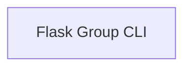

# Flask Group CLI

A specialized command group for Flask applications that loads app-specific commands, handles environment setup, and provides default CLI commands.

## Components

This module contains 1 component(s):

- `src.flask.cli.FlaskGroup`

## Structure

---
*This documentation was auto-generated to ensure completeness.*
