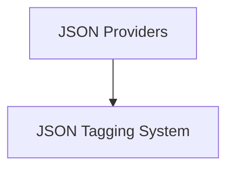

# Flask JSON Module

## Introduction

The `flask_json` module in Flask provides robust and flexible functionalities for handling JSON data within web applications. It abstracts the complexities of JSON serialization and deserialization, allowing developers to easily convert Python objects to JSON responses and parse incoming JSON requests. This module is essential for building RESTful APIs and web services that communicate using JSON.

## Architecture

The `flask_json` module is composed of two main sub-modules:

<!-- DIAGRAM_JSON
{
    "direction": "TD",
    "nodes": [
        {"id": "json_providers", "label": "JSON Providers", "type": "module", "link": "json_providers.md"},
        {"id": "json_tagging", "label": "JSON Tagging System", "type": "module", "link": "json_tagging.md"}
    ],
    "edges": [
        {"source": "json_providers", "target": "json_tagging"}
    ],
    "groups": []
}
-->

### Sub-modules Overview

*   **[JSON Providers](json_providers.md)**: This sub-module defines the interface and default implementation for handling JSON serialization and deserialization across the Flask application. It allows for customization of how Python objects are converted to JSON strings and vice-versa, including handling common data types and creating JSON responses.

*   **[JSON Tagging System](json_tagging.md)**: This sub-module offers a sophisticated mechanism for tagging and serializing complex Python objects that are not natively supported by standard JSON. It uses a tag-based approach to represent types like `datetime`, `UUID`, `bytes`, and custom dict/list structures, making them safely serializable and deserializable for purposes such as secure session data or signed tokens.