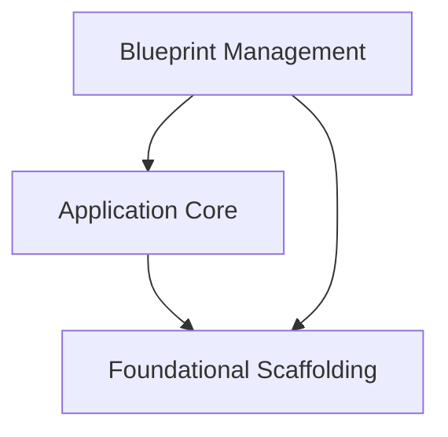

# Flask Sans-IO Module Documentation

## Introduction

The `flask_sansio` module provides the core components for building Sans-IO (Input/Output-agnostic) Flask applications. This allows for greater flexibility in integrating Flask with different asynchronous I/O frameworks or custom event loops, separating the application's logic from its I/O operations. It re-implements key Flask concepts like `App` and `Blueprint` in a Sans-IO manner, inheriting foundational utilities from `Scaffold`.

## Architecture Overview

The `flask_sansio` module is structured around three main conceptual areas:

*   **Application Core**: This contains the primary `App` object, which is the central registry for the application, handling configuration, routing, and overall request processing in a Sans-IO way.
*   **Blueprint Management**: This sub-module provides the `Blueprint` object for organizing application components into reusable and modular units, along with `BlueprintSetupState` to manage their registration.
*   **Foundational Scaffolding**: This provides the base `Scaffold` class, which offers common functionalities like static file handling, template folder management, and URL rule definition, shared by both the `App` and `Blueprint` objects.

The `Scaffold` acts as the base class for both `App` and `Blueprint`, providing shared core functionalities. Blueprints are registered with the `App` to integrate their routes and functionalities into the main application.

<!-- DIAGRAM_JSON
{
    "direction": "TD",
    "nodes": [
        {"id": "scaffolding", "label": "Foundational Scaffolding", "type": "module", "link": "scaffolding.md"},
        {"id": "application_core", "label": "Application Core", "type": "module", "link": "application_core.md"},
        {"id": "blueprints", "label": "Blueprint Management", "type": "module", "link": "blueprints.md"}
    ],
    "edges": [
        {"source": "application_core", "target": "scaffolding"},
        {"source": "blueprints", "target": "scaffolding"},
        {"source": "blueprints", "target": "application_core"}
    ],
    "groups": []
}
-->

## Sub-modules

### [Application Core](application_core.md)

This sub-module focuses on the `App` class, the central object of the Flask-Sans-IO application. It handles global configurations, URL routing, and the integration of various components and extensions.

### [Blueprint Management](blueprints.md)

This sub-module provides the `Blueprint` class for creating modular and reusable application components. It also includes `BlueprintSetupState`, which facilitates the registration and setup of blueprints within the main application.

### [Foundational Scaffolding](scaffolding.md)

This sub-module contains the `Scaffold` class, which serves as a base for both `App` and `Blueprint`. It provides common functionalities such as managing static files, template folders, and basic URL rule definitions, ensuring consistency and reusability across core Flask-Sans-IO components.

