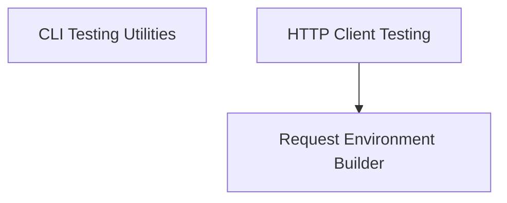

# `flask_testing` Module Documentation

The `flask_testing` module provides essential utilities for testing Flask applications. It offers specialized tools to simulate client requests, interact with the application's command-line interface (CLI), and configure the testing environment, ensuring robust and reliable testing of Flask-based projects.

## Architecture

The `flask_testing` module is structured into the following key sub-modules:

<!-- DIAGRAM_JSON
{
    "direction": "TD",
    "nodes": [
        {"id": "cli_testing", "label": "CLI Testing Utilities", "type": "module", "link": "cli_testing.md"},
        {"id": "client_testing", "label": "HTTP Client Testing", "type": "module", "link": "client_testing.md"},
        {"id": "environment_builder", "label": "Request Environment Builder", "type": "module", "link": "environment_builder.md"}
    ],
    "edges": [
        {"source": "client_testing", "target": "environment_builder"}
    ],
    "groups": []
}
-->

## Sub-modules Overview

*   **[CLI Testing Utilities](cli_testing.md)**: This sub-module focuses on testing the command-line interface (CLI) of a Flask application. It provides tools like `FlaskCliRunner` to invoke CLI commands in an isolated environment, similar to how a user would interact with the application's CLI. It integrates with `flask_cli` for handling CLI specific functionality.

*   **[HTTP Client Testing](client_testing.md)**: This sub-module provides `FlaskClient`, an extension of Werkzeug's test client, designed for simulating HTTP requests to a Flask application. It offers advanced features like session transaction management and context preservation, which are crucial for comprehensive web application testing.

*   **[Request Environment Builder](environment_builder.md)**: The `environment_builder` sub-module, primarily through `EnvironBuilder`, is responsible for constructing and configuring the WSGI environment for test requests. It takes default values from the Flask application's configuration, allowing for flexible and realistic test environment setup, and is utilized by `FlaskClient`.
