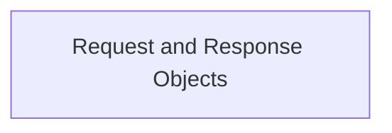

# http_wrappers Module Documentation

## Introduction
The `http_wrappers` module in Flask is responsible for providing robust and flexible HTTP request and response objects. These objects (`Request` and `Response`) are fundamental to how a Flask application interacts with clients, abstracting the complexities of the WSGI environment into user-friendly Python objects. This module ensures that developers can easily access incoming request data and construct outgoing responses with appropriate headers, content, and status codes.

## Architecture
The `http_wrappers` module primarily consists of two core components: `Request` and `Response`. These components are direct subclasses of Werkzeug's `RequestBase` and `ResponseBase`, extending their functionality with Flask-specific features such as JSON support and integration with the Flask application context.

<!-- DIAGRAM_JSON
{
    "direction": "TD",
    "nodes": [
        {"id": "http_wrappers_components", "label": "Request and Response Objects", "type": "module", "link": "http_wrappers_components.md"}
    ],
    "edges": [],
    "groups": []
}
-->

## Sub-modules

### [Request and Response Objects](http_wrappers_components.md)
This sub-module encapsulates the `Request` and `Response` classes, which are central to handling HTTP communications within a Flask application. The `Request` object parses incoming HTTP requests, providing access to form data, JSON payloads, headers, and URL parameters. The `Response` object allows applications to construct HTTP responses, setting status codes, headers, and body content. Both classes integrate with Flask's configuration for features like maximum content length and cookie handling, ensuring secure and efficient data transfer.