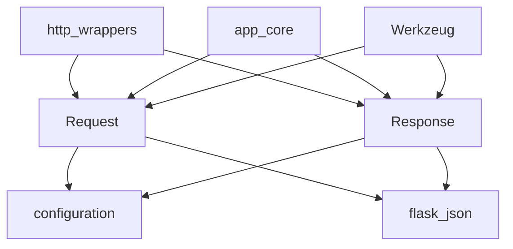

# http_wrappers_components

This module encapsulates the core HTTP request and response objects used throughout the Flask application. It provides specialized `Request` and `Response` classes that extend Werkzeug's base wrappers with Flask-specific functionalities, making them integral to handling incoming client requests and crafting outgoing server responses.

## Core Components

### `Request`
The `Request` class is Flask's default request object, inheriting from Werkzeug's `RequestBase`. It extends the base functionality by remembering the matched endpoint and view arguments. This object is accessible via `flask.request` within an application context.

Key functionalities and properties include:
-   **`url_rule`**: The internal URL rule that matched the request, useful for inspecting allowed methods.
-   **`view_args`**: A dictionary of view arguments that matched the request.
-   **`routing_exception`**: Stores any exception that occurred during URL matching, such as `NotFound`.
-   **`max_content_length`**: Configurable maximum content length for incoming request data, defaulting to `MAX_CONTENT_LENGTH` from the application's configuration. Can be set per-request.
-   **`max_form_memory_size`**: Configurable maximum size for non-file form fields, defaulting to `MAX_FORM_MEMORY_SIZE` from the application's configuration.
-   **`max_form_parts`**: Configurable maximum number of fields in a `multipart/form-data` body, defaulting to `MAX_FORM_PARTS` from the application's configuration.
-   **`endpoint`**: The endpoint name that matched the request URL, derived from `url_rule`.
-   **`blueprint`**: The registered name of the current blueprint, if the endpoint is part of one.
-   **`blueprints`**: A list of registered blueprint names, traversing upwards through parent blueprints.
-   **JSON Handling**: Integrates with the `json_module` for processing JSON request bodies, providing an `on_json_loading_failed` hook for error handling.
-   **Debugging Support**: In debug mode, it includes a mechanism to attach an `enctype` error multidict if the mimetype is not `multipart/form-data` and no files are present.

### `Response`
The `Response` class is Flask's default response object, inheriting from Werkzeug's `ResponseBase`. It primarily sets an HTML mimetype by default and provides Flask-specific enhancements. Developers rarely create this object directly as Flask's `make_response` function handles its instantiation.

Key functionalities and properties include:
-   **`default_mimetype`**: Set to `"text/html"` by default.
-   **`json_module`**: Integrates with the `json_module` for handling JSON responses, useful for testing and API responses.
-   **`autocorrect_location_header`**: A boolean flag to control automatic correction of the `Location` header.
-   **`max_cookie_size`**: Read-only property reflecting the `MAX_COOKIE_SIZE` configuration key from the application.

## Architecture and Component Relationships

The `http_wrappers_components` module provides fundamental building blocks for HTTP communication within a Flask application. Both `Request` and `Response` classes are central to how Flask processes web requests and generates responses. They extend core functionalities from Werkzeug, adding Flask-specific context and configuration awareness.

The components rely heavily on the application's configuration, accessible through `current_app.config`, for settings like content length limits and cookie sizes. They also integrate with the JSON serialization capabilities provided by Flask (potentially via the `flask_json` module) for handling JSON data in both requests and responses.

This module is a leaf module within the `http_wrappers` module, which itself is part of the `app_core` module. This hierarchical structure indicates that these wrappers are specialized components within Flask's core application logic for handling HTTP interactions.

<!-- DIAGRAM_JSON
{
    "direction": "TD",
    "nodes": [
        {"id": "request", "label": "Request", "type": "component", "link": null},
        {"id": "response", "label": "Response", "type": "component", "link": null},
        {"id": "http_wrappers", "label": "http_wrappers", "type": "external", "link": "http_wrappers.md"},
        {"id": "app_core", "label": "app_core", "type": "external", "link": "app_core.md"},
        {"id": "configuration", "label": "configuration", "type": "external", "link": "configuration.md"},
        {"id": "flask_json", "label": "flask_json", "type": "external", "link": "flask_json.md"},
        {"id": "werkzeug", "label": "Werkzeug", "type": "external", "link": null}
    ],
    "edges": [
        {"source": "http_wrappers", "target": "request"},
        {"source": "http_wrappers", "target": "response"},
        {"source": "app_core", "target": "request"},
        {"source": "app_core", "target": "response"},
        {"source": "request", "target": "configuration"},
        {"source": "response", "target": "configuration"},
        {"source": "request", "target": "flask_json"},
        {"source": "response", "target": "flask_json"},
        {"source": "werkzeug", "target": "request"},
        {"source": "werkzeug", "target": "response"}
    ],
    "groups": []
}
-->

## How the Module Fits into the Overall System

The `http_wrappers_components` module is fundamental to the Flask application's ability to handle HTTP requests and generate responses. The `Request` object provides a structured way to access incoming data, headers, and URL parameters, while the `Response` object allows for programmatic construction of HTTP responses, including setting status codes, headers, and content.

These wrappers are instantiated and managed by the higher-level `app_core` module, which orchestrates the request-response cycle. They interact closely with the [configuration.md](configuration.md) module to apply application-wide settings and leverage the [flask_json.md](flask_json.md) module for efficient JSON data handling. Essentially, `http_wrappers_components` provides the concrete HTTP objects that the rest of the Flask framework uses to communicate with clients.
