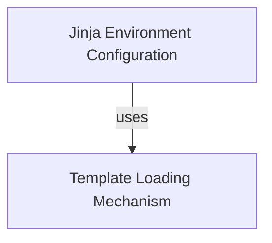

# Jinja Templating Module

The `jinja_templating` module in Flask is responsible for integrating the Jinja2 templating engine, providing robust and flexible template rendering capabilities for web applications. It extends Jinja2's core functionalities to work seamlessly within the Flask ecosystem, especially concerning template loading from various sources like the main application and blueprints.

## Architecture

The module comprises two primary components: the Jinja Environment and the Template Loading Mechanism. The Jinja Environment configures the templating engine, while the Template Loading Mechanism efficiently locates and loads templates.

<!-- DIAGRAM_JSON
{
    "direction": "TD",
    "nodes": [
        {"id": "jinja_environment", "label": "Jinja Environment Configuration", "type": "module", "link": "jinja_environment.md"},
        {"id": "template_loading", "label": "Template Loading Mechanism", "type": "module", "link": "template_loading.md"}
    ],
    "edges": [
        {"source": "jinja_environment", "target": "template_loading", "label": "uses"}
    ],
    "groups": []
}
-->

## Sub-modules

### [Jinja Environment Configuration](jinja_environment.md)
This sub-module focuses on the `Environment` class, which extends the base Jinja2 environment to integrate with Flask's application and blueprint structure.

### [Template Loading Mechanism](template_loading.md)
This sub-module details the `DispatchingJinjaLoader`, a custom Jinja2 loader that can search for templates across the main application and all registered blueprints. It also provides debugging utilities for explaining template loading attempts.
