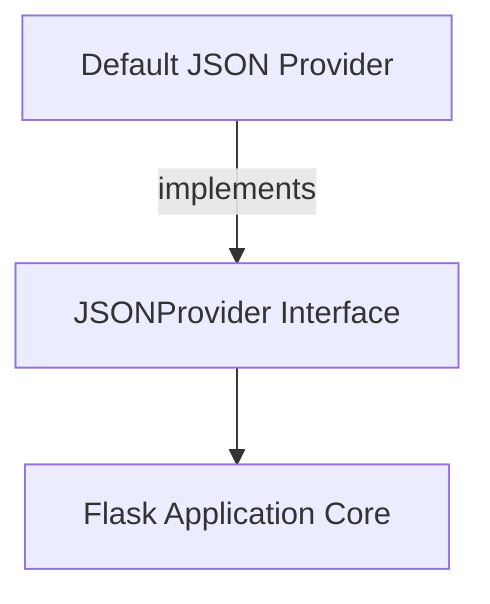

# `json_provider_interface` Module Documentation

## Introduction

The `json_provider_interface` module defines the `JSONProvider` abstract base class, which establishes a standard interface for handling JSON serialization and deserialization operations within a Flask application. This module provides a flexible mechanism for developers to customize Flask's JSON behavior by implementing their own JSON providers or by integrating different JSON libraries.

## Core Functionality and Purpose

The primary purpose of the `json_provider_interface` module is to provide a contract for how Flask applications should perform JSON-related tasks. It serves as an abstraction layer, allowing the underlying JSON implementation to be swapped without affecting the rest of the application's code that relies on JSON.

The `JSONProvider` class outlines the essential methods for JSON handling:

*   `dumps(obj, **kwargs)`: Serializes a Python object into a JSON string.
*   `dump(obj, fp, **kwargs)`: Serializes a Python object and writes it to a file-like object.
*   `loads(s, **kwargs)`: Deserializes a JSON string or bytes into a Python object.
*   `load(fp, **kwargs)`: Deserializes JSON data read from a file-like object.
*   `response(*args, **kwargs)`: A convenience method to serialize given arguments as JSON and return a `Response` object with the `application/json` mimetype.

By default, Flask uses the `DefaultJSONProvider` (documented in [default_json_provider.md](default_json_provider.md)), which is an implementation of this interface.

## Architecture and Component Relationships

The `json_provider_interface` module contains one primary component: `JSONProvider`.

### `JSONProvider`

`JSONProvider` is an abstract class that requires subclasses to implement at least the `dumps` and `loads` methods. It holds a weak reference to the Flask application instance (`_app`), allowing it to interact with application-level components such as the response class.

```python
class JSONProvider:
    # ... (simplified for documentation)
    def __init__(self, app: App) -> None:
        self._app: App = weakref.proxy(app)

    def dumps(self, obj: t.Any, **kwargs: t.Any) -> str:
        raise NotImplementedError

    def loads(self, s: str | bytes, **kwargs: t.Any) -> t.Any:
        raise NotImplementedError

    def response(self, *args: t.Any, **kwargs: t.Any) -> Response:
        obj = self._prepare_response_obj(args, kwargs)
        return self._app.response_class(self.dumps(obj), mimetype="application/json")
```

### Relationships

*   **`JSONProvider` to `flask_application_core`**: The `JSONProvider` maintains a reference to the Flask application (`_app`), which is an instance of `flask.app.Flask` from the [flask_application_core.md](flask_application_core.md) module. This allows the provider to access application-specific configurations and components, such as `app.response_class` when generating JSON responses.
*   **`JSONProvider` to `default_json_provider`**: The `DefaultJSONProvider` module contains the concrete implementation of the `JSONProvider` interface used by Flask by default. Developers can replace this default with their custom implementation.

## How the Module Fits into the Overall System

The `json_provider_interface` module is a fundamental part of Flask's extensibility for JSON handling. It provides the necessary abstraction that enables different JSON libraries or custom serialization/deserialization logic to be seamlessly integrated into a Flask application without modifying the core framework. This modularity is crucial for applications with specific JSON requirements, such as custom encoders for complex data types or integration with faster JSON parsers.

By defining this interface, Flask ensures that any part of the application expecting JSON operations can rely on a consistent API, regardless of the underlying implementation. This makes Flask highly adaptable to various data serialization needs.

<!-- DIAGRAM_JSON
{
    "direction": "TD",
    "nodes": [
        {"id": "json_provider_interface", "label": "JSONProvider Interface", "type": "component", "link": null},
        {"id": "flask_app_core", "label": "Flask Application Core", "type": "external", "link": "flask_application_core.md"},
        {"id": "default_json_provider", "label": "Default JSON Provider", "type": "external", "link": "default_json_provider.md"}
    ],
    "edges": [
        {"source": "json_provider_interface", "target": "flask_app_core"},
        {"source": "default_json_provider", "target": "json_provider_interface", "label": "implements"}
    ],
    "groups": []
}
-->
