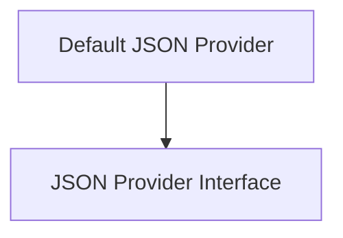

# JSON Providers Module

## Introduction

The `json_providers` module in Flask provides a flexible and extensible way to handle JSON serialization and deserialization within a Flask application. It defines an interface for JSON operations and offers a default implementation using Python's built-in `json` library, with extended support for various data types.

This module allows developers to customize how JSON is processed, enabling the integration of different JSON libraries or adding custom serialization logic for specific object types.

## Architecture Overview

The `json_providers` module is composed of two core components:

*   **`JSONProvider`**: An abstract base class defining the contract for JSON operations.
*   **`DefaultJSONProvider`**: A concrete implementation leveraging Python's standard `json` module with enhanced serialization for common Python types.

These components work together to provide a seamless JSON handling experience in Flask applications, from simple object serialization to complex data type conversions for API responses.

<!-- DIAGRAM_JSON
{
    "direction": "TD",
    "nodes": [
        {"id": "json_provider_interface", "label": "JSON Provider Interface", "type": "module", "link": "json_provider_interface.md"},
        {"id": "default_json_provider", "label": "Default JSON Provider", "type": "module", "link": "default_json_provider.md"}
    ],
    "edges": [
        {"source": "default_json_provider", "target": "json_provider_interface"}
    ],
    "groups": []
}
-->

## Sub-modules

This module is structured into the following sub-modules, each serving a distinct purpose in handling JSON operations:

*   **[JSON Provider Interface](json_provider_interface.md)**: Defines the foundational interface for all JSON providers, outlining the essential methods for serialization and deserialization. This allows for interchangeable JSON backends.
*   **[Default JSON Provider](default_json_provider.md)**: Provides a ready-to-use implementation of the `JSONProvider` using Python's standard `json` library. It extends the default `json` behavior to gracefully handle common data types such as `datetime`, `UUID`, and `dataclasses`, ensuring these types are correctly serialized into JSON-compatible formats. This provider is the default choice for most Flask applications, offering a balance of functionality and ease of use.