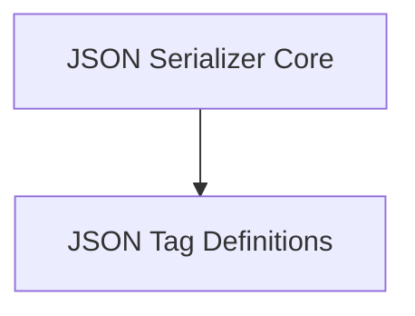

# json_tagging Module Documentation

The `json_tagging` module in Flask provides a robust and extensible system for serializing and deserializing non-standard JSON types. It extends the basic JSON capabilities by allowing custom Python objects (like `datetime`, `UUID`, `bytes`, `Markup`, `tuples`, and `dicts` with specific keys) to be represented in a JSON-compatible format using a tagging mechanism. This module is crucial for maintaining data integrity and type information when dealing with complex Python objects in JSON contexts, especially within web applications where data exchange is frequent.

## Architecture Overview

The `json_tagging` module is composed of two main logical sub-modules:

*   **[JSON Serializer Core](serializer_core.md)**: Manages the overall serialization and deserialization process, orchestrating how different types are tagged and untagged.
*   **[JSON Tag Definitions](tag_definitions.md)**: Contains the base class for defining custom tags and various concrete implementations for common Python types.

<!-- DIAGRAM_JSON
{
    "direction": "TD",
    "nodes": [
        {"id": "serializer_core", "label": "JSON Serializer Core", "type": "module", "link": "serializer_core.md"},
        {"id": "tag_definitions", "label": "JSON Tag Definitions", "type": "module", "link": "tag_definitions.md"}
    ],
    "edges": [
        {"source": "serializer_core", "target": "tag_definitions"}
    ],
    "groups": []
}
-->

## Sub-modules

### [JSON Serializer Core](serializer_core.md)

This sub-module is centered around the `TaggedJSONSerializer` component. It acts as the central orchestrator for the tagging system, providing methods to register new tags, convert Python objects to their tagged JSON representations (`tag` method), and reconstruct Python objects from tagged JSON representations (`untag` method). It integrates with `itsdangerous.Serializer` for secure serialization, ensuring that non-standard types are handled correctly during the process.

### [JSON Tag Definitions](tag_definitions.md)

This sub-module defines the foundation for creating custom JSON tags and includes several built-in tag implementations. The `JSONTag` serves as the abstract base class, outlining the interface for checking if a value should be tagged (`check`), converting a Python object to a JSON-compatible type (`to_json`), and converting back from JSON to the Python type (`to_python`). Concrete implementations like `TagMarkup`, `TagDateTime`, `TagUUID`, `TagBytes`, `TagDict`, `TagTuple`, `PassList`, and `PassDict` handle specific data types, providing efficient and accurate serialization and deserialization for each. These tags ensure that complex Python objects can be seamlessly encoded into and decoded from JSON without loss of information.