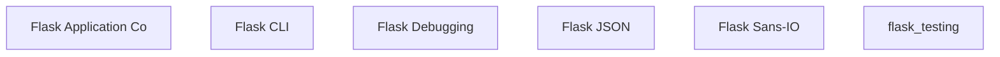

# Flask New

## Overview

This repository contains 6 main modules.

## Modules

### [Flask Application Core](flask_application_core.md)

Provides 23 component(s) for flask application core operations.

### [Flask CLI](flask_cli.md)

The `flask_cli` module provides the command-line interface (CLI) for Flask applications, enabling developers to run, manage, and interact with their applications through a terminal. It builds upon ...

### [Flask Debugging](flask_debugging.md)

The `flask_debugging` module provides a set of tools and helpers specifically designed to aid in debugging Flask applications. It focuses on identifying and preventing common issues that might aris...

### [Flask JSON](flask_json.md)

The `flask_json` module in Flask provides robust and flexible functionalities for handling JSON data within web applications. It abstracts the complexities of JSON serialization and deserialization...

### [Flask Sans-IO](flask_sansio.md)

The `flask_sansio` module provides the core components for building Sans-IO (Input/Output-agnostic) Flask applications. This allows for greater flexibility in integrating Flask with different async...

### [`flask_testing`](flask_testing.md)

The `flask_testing` module provides essential utilities for testing Flask applications. It offers specialized tools to simulate client requests, interact with the application's command-line interfa...

## Architecture

