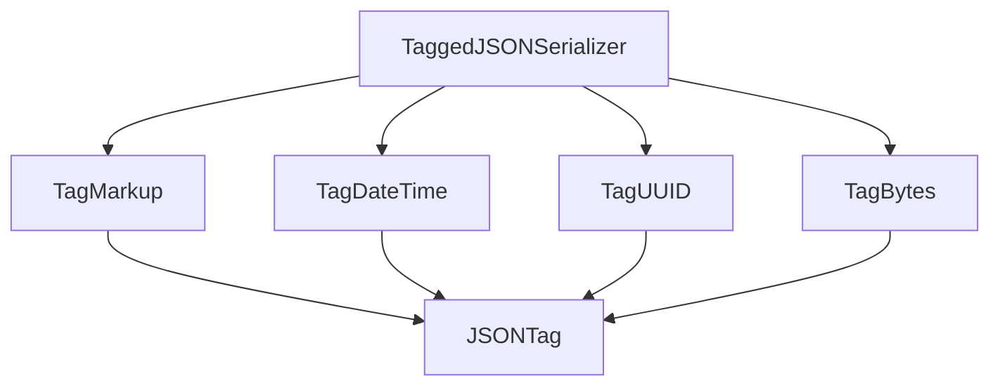

# primitive_type_tags Module Documentation

The `primitive_type_tags` module is a vital part of Flask's JSON serialization mechanism, specifically designed to handle the encoding and decoding of several common primitive-like data types that are not natively supported by standard JSON. It provides specialized tag classes for `Markup`, `datetime` objects, `UUID` objects, and `bytes` objects, enabling their seamless conversion to and from JSON formats. This ensures that these types can be safely transmitted and reconstructed when Flask applications interact with JSON data.

## Core Functionality

This module implements concrete `JSONTag` subclasses, each responsible for checking a specific data type, serializing it into a JSON-compatible format, and deserializing it back into its original Python object.

### `TagMarkup`
The `TagMarkup` class handles objects that conform to the `markupsafe.Markup` API, typically used for HTML-safe strings.

-   **Purpose**: Serializes objects with an `__html__` method (like `Markup` objects) into their string representation and deserializes them back into `Markup` instances.
-   **Key**: ` m`
-   **Methods**:
    -   `check(value)`: Returns `True` if the `value` has a callable `__html__` attribute.
    -   `to_json(value)`: Returns the string result of `value.__html__()`.
    -   `to_python(value)`: Converts the JSON string `value` back into a `Markup` object.

### `TagDateTime`
The `TagDateTime` class manages the serialization and deserialization of `datetime` objects.

-   **Purpose**: Converts Python `datetime` objects into HTTP-date formatted strings for JSON and parses them back.
-   **Key**: ` d`
-   **Methods**:
    -   `check(value)`: Returns `True` if the `value` is an instance of `datetime`.
    -   `to_json(value)`: Converts the `datetime` object into an HTTP-date formatted string.
    -   `to_python(value)`: Parses the HTTP-date string `value` back into a `datetime` object.

### `TagUUID`
The `TagUUID` class provides serialization and deserialization for `UUID` objects.

-   **Purpose**: Converts Python `UUID` objects into their hexadecimal string representation for JSON and reconstructs them.
-   **Key**: ` u`
-   **Methods**:
    -   `check(value)`: Returns `True` if the `value` is an instance of `UUID`.
    -   `to_json(value)`: Returns the hexadecimal string representation of the `UUID`.
    -   `to_python(value)`: Creates a `UUID` object from its hexadecimal string `value`.

### `TagBytes`
The `TagBytes` class handles the encoding and decoding of `bytes` objects.

-   **Purpose**: Converts Python `bytes` objects into base64-encoded ASCII strings for JSON and decodes them back.
-   **Key**: ` b`
-   **Methods**:
    -   `check(value)`: Returns `True` if the `value` is an instance of `bytes`.
    -   `to_json(value)`: Base64-encodes the `bytes` object and decodes it to an ASCII string.
    -   `to_python(value)`: Base64-decodes the string `value` back into a `bytes` object.

## Architecture

The `primitive_type_tags` module consists of several `JSONTag` implementations. These tags inherit from the base `JSONTag` class defined in the [base_tagging module](base_tagging.md) and are utilized by the [serializer_core module](serializer_core.md) (`TaggedJSONSerializer`) to perform the actual serialization and deserialization within Flask's JSON handling.

<!-- DIAGRAM_JSON
{
    "direction": "TD",
    "nodes": [
        {"id": "tag_markup", "label": "TagMarkup", "type": "component", "link": null},
        {"id": "tag_datetime", "label": "TagDateTime", "type": "component", "link": null},
        {"id": "tag_uuid", "label": "TagUUID", "type": "component", "link": null},
        {"id": "tag_bytes", "label": "TagBytes", "type": "component", "link": null},
        {"id": "json_tag", "label": "JSONTag", "type": "external", "link": "base_tagging.md"},
        {"id": "tagged_json_serializer", "label": "TaggedJSONSerializer", "type": "external", "link": "serializer_core.md"}
    ],
    "edges": [
        {"source": "tag_markup", "target": "json_tag"},
        {"source": "tag_datetime", "target": "json_tag"},
        {"source": "tag_uuid", "target": "json_tag"},
        {"source": "tag_bytes", "target": "json_tag"},
        {"source": "tagged_json_serializer", "target": "tag_markup"},
        {"source": "tagged_json_serializer", "target": "tag_datetime"},
        {"source": "tagged_json_serializer", "target": "tag_uuid"},
        {"source": "tagged_json_serializer", "target": "tag_bytes"}
    ],
    "groups": []
}
-->

## Integration with the System

The `primitive_type_tags` module is a leaf module within the `json_tagging` sub-module of `flask_json`. It directly provides the concrete tag implementations that the `TaggedJSONSerializer` uses to extend Flask's default JSON encoding capabilities. By offering specific handling for `Markup`, `datetime`, `UUID`, and `bytes`, it ensures that these complex types can be reliably serialized into standard JSON and deserialized back into their Python equivalents, maintaining data integrity across API communications and data storage operations within a Flask application. This module enhances the robustness and flexibility of Flask's JSON handling, making it suitable for a wider range of data types out-of-the-box.
