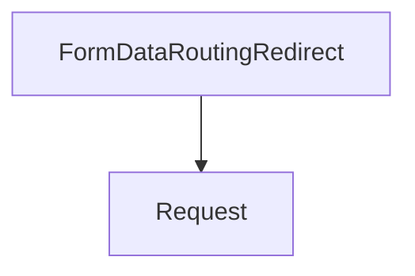

# redirect_handling Module Documentation

## Introduction
The `redirect_handling` module, part of `flask_debugging`, provides mechanisms to alert developers in debug mode about potentially problematic routing redirects that could lead to data loss in client requests. Its primary component, `FormDataRoutingRedirect`, specifically targets scenarios where a browser might drop form data or change HTTP methods during a redirect.

## Comprehensive Documentation

### `FormDataRoutingRedirect`

The `FormDataRoutingRedirect` class is an `AssertionError` subclass raised exclusively in Flask's debug mode. Its purpose is to prevent subtle data loss issues that can arise from improper HTTP redirects.

**Purpose:**
This exception is triggered when Flask's routing mechanism issues a redirect (e.g., from `/path` to `/path/` for canonical URLs, or vice-versa) under specific conditions that would cause a client (browser) to discard the request method (if not GET, HEAD, or OPTIONS) or the request body. This typically happens when a redirect uses a status code other than `307` (Temporary Redirect) or `308` (Permanent Redirect) for non-GET/HEAD/OPTIONS requests. Browsers commonly convert POST requests to GET requests after a 301 (Moved Permanently) or 302 (Found) redirect, leading to the loss of the original form data.

**Behavior:**
When `FormDataRoutingRedirect` is raised, it constructs a detailed error message informing the developer:
1. The original URL and the canonical URL to which the request was redirected.
2. If the redirect is due to a trailing slash inconsistency (e.g., `/foo` redirected to `/foo/`), it explicitly mentions this.
3. It provides clear guidance: either send requests directly to the canonical URL or use HTTP status codes `307` or `308` for routing redirects to preserve the method and body.

This mechanism helps developers identify and fix problematic redirect configurations during development, preventing data integrity issues in production.

**Example Scenario:**
Consider a POST request to `/submit` which is configured to redirect to `/submit/` using a default 302 redirect. A browser receiving this 302 redirect for a POST request will often re-issue it as a GET request to `/submit/`, effectively losing all the data originally sent in the POST body. `FormDataRoutingRedirect` intercepts this during debug mode, alerting the developer to use a 307 or 308 redirect instead, or to send the request directly to `/submit/`.

## Architecture and Component Relationships

<!-- DIAGRAM_JSON
{
    "direction": "TD",
    "nodes": [
        {"id": "form_data_routing_redirect", "label": "FormDataRoutingRedirect", "type": "component", "link": null},
        {"id": "request", "label": "Request", "type": "external", "link": "flask_application_core.md"}
    ],
    "edges": [
        {"source": "form_data_routing_redirect", "target": "request"}
    ],
    "groups": []
}
-->

## How the module fits into the overall system:

The `redirect_handling` module is a crucial part of Flask's debugging utilities, residing within the `flask_debugging` module. It plays a preventative role by ensuring that developers are aware of redirect practices that can lead to data loss, especially when dealing with form submissions or API requests with bodies. By raising an `AssertionError` in debug mode, it forces developers to address these issues early in the development cycle, contributing to more robust and predictable application behavior. It interacts directly with the core request handling mechanisms provided by the [flask_application_core](flask_application_core.md) module, specifically inspecting `Request` objects and their `routing_exception`.