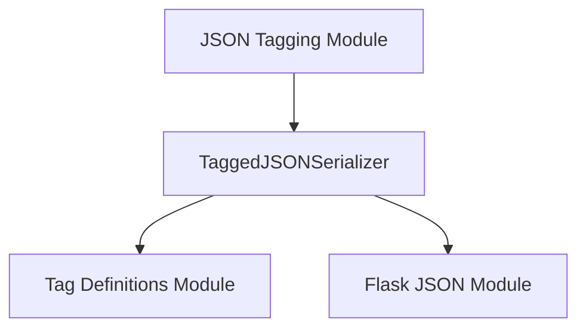

# `serializer_core` Module Documentation

The `serializer_core` module is a fundamental part of Flask's JSON serialization capabilities, specifically designed to handle Python objects that are not natively supported by standard JSON. Its primary purpose is to provide a mechanism for serializing complex Python types into a compact, tagged JSON format and deserializing them back to their original form.

## Core Functionality

The `serializer_core` module centers around the `TaggedJSONSerializer` class, which acts as an intermediate serializer for `itsdangerous.Serializer` within Flask.

### `TaggedJSONSerializer`

The `TaggedJSONSerializer` class enables the serialization and deserialization of a specific set of non-standard JSON types using a "tag" system. This ensures that richer Python objects can be safely transmitted and reconstructed.

**Supported Extra Types:**

*   `dict`
*   `tuple`
*   `bytes`
*   `markupsafe.Markup`
*   `uuid.UUID`
*   `datetime.datetime`

#### Class Attributes:

*   `default_tags`: A list of tag classes (`[TagDict, PassDict, TagTuple, PassList, TagBytes, TagMarkup, TagUUID, TagDateTime]`) that are registered by default when a `TaggedJSONSerializer` instance is created. These tags define how specific Python types are converted to and from their tagged JSON representation. For more details on these tag definitions, refer to the [tag_definitions module documentation](tag_definitions.md).

#### Methods:

*   `__init__(self)`: Initializes the serializer, setting up `tags` (a dictionary mapping tag keys to `JSONTag` instances) and `order` (a list defining the priority of tags for checking values). It registers all `default_tags`.

*   `register(self, tag_class, force=False, index=None)`:
    Registers a new tag class with the serializer. This allows for extending the types that can be handled.
    *   `tag_class`: The `JSONTag` subclass to register.
    *   `force`: If `True`, overwrites an existing tag with the same key. Defaults to `False`, raising a `KeyError` if a duplicate key is found.
    *   `index`: An optional integer specifying where to insert the new tag in the processing order. Useful for special-case tags that need to be checked before more general ones.

*   `tag(self, value)`:
    Converts a given Python `value` into its tagged representation if it matches any of the registered tags. It iterates through registered tags in `order` and returns the first matching tagged value.

*   `untag(self, value)`:
    Converts a tagged `value` (expected to be a dictionary with a single tag key) back into its original Python type. If the key is not recognized, the original `value` is returned.

*   `_untag_scan(self, value)`:
    A recursive helper method used internally by `loads` to traverse nested dictionaries and lists, untagging any recognized tagged objects within them.

*   `dumps(self, value)`:
    First, tags the input `value` using the `tag` method, and then serializes the result into a compact JSON string using Flask's internal JSON `dumps` utility (from the [flask_json module](flask_json.md)).

*   `loads(self, value)`:
    Deserializes a JSON string into a Python object using Flask's internal JSON `loads` utility (from the [flask_json module](flask_json.md)), and then recursively untags any recognized objects using `_untag_scan`.

## Architecture and Component Relationships

This module is a key part of the larger [flask_json module](flask_json.md) and specifically falls under the [json_tagging module](json_tagging.md), which groups all the tagging-related functionalities. The `TaggedJSONSerializer` relies heavily on the specific tag implementations defined in the [tag_definitions module](tag_definitions.md) to perform its serialization and deserialization tasks.

<!-- DIAGRAM_JSON
{
    "direction": "TD",
    "nodes": [
        {"id": "tagged_json_serializer", "label": "TaggedJSONSerializer", "type": "component", "link": null},
        {"id": "json_tagging_module", "label": "JSON Tagging Module", "type": "external", "link": "json_tagging.md"},
        {"id": "tag_definitions_module", "label": "Tag Definitions Module", "type": "external", "link": "tag_definitions.md"},
        {"id": "flask_json_module", "label": "Flask JSON Module", "type": "external", "link": "flask_json.md"}
    ],
    "edges": [
        {"source": "json_tagging_module", "target": "tagged_json_serializer"},
        {"source": "tagged_json_serializer", "target": "tag_definitions_module"},
        {"source": "tagged_json_serializer", "target": "flask_json_module"}
    ],
    "groups": []
}
-->
