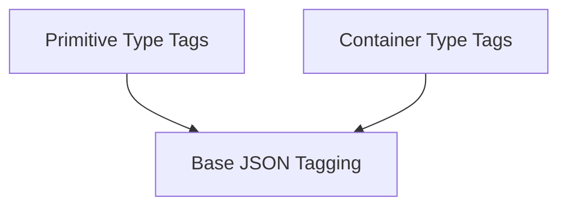

# tag_definitions Module Documentation

## Introduction
The `tag_definitions` module within `flask_json` provides a robust system for tagging and untagging various Python data types during JSON serialization and deserialization. This ensures that complex objects, not natively supported by JSON, can be safely transmitted and reconstructed, maintaining their original type and structure.

## Architecture
The module's architecture is centered around a base `JSONTag` class, which defines the interface for custom type tagging. Specific implementations extend this base class to handle different data types, categorizing them into primitive and container types.

<!-- DIAGRAM_JSON
{
    "direction": "TD",
    "nodes": [
        {"id": "base_tagging", "label": "Base JSON Tagging", "type": "module", "link": "base_tagging.md"},
        {"id": "primitive_type_tags", "label": "Primitive Type Tags", "type": "module", "link": "primitive_type_tags.md"},
        {"id": "container_type_tags", "label": "Container Type Tags", "type": "module", "link": "container_type_tags.md"}
    ],
    "edges": [
        {"source": "primitive_type_tags", "target": "base_tagging"},
        {"source": "container_type_tags", "target": "base_tagging"}
    ],
    "groups": []
}
-->

## Sub-modules Overview

### [Base JSON Tagging](base_tagging.md)
This sub-module defines the abstract `JSONTag` class, serving as the foundational interface for all custom JSON serialization and deserialization tags within Flask. It outlines the essential methods for checking if a value should be tagged (`check`), converting it to a JSON-compatible format (`to_json`), and reconstructing the Python object from its JSON representation (`to_python`).

### [Primitive Type Tags](primitive_type_tags.md)
This sub-module provides specific `JSONTag` implementations for handling various primitive-like data types. It includes tags for `Markup` objects (e.g., HTML strings), `datetime` objects, `UUID` objects, and `bytes` objects, enabling their seamless serialization and deserialization to and from JSON.

### [Container Type Tags](container_type_tags.md)
This sub-module focuses on `JSONTag` implementations designed for container data structures such as dictionaries and lists. It provides mechanisms to properly serialize and deserialize these complex types, including special handling for dictionaries where the key itself might represent a tag.