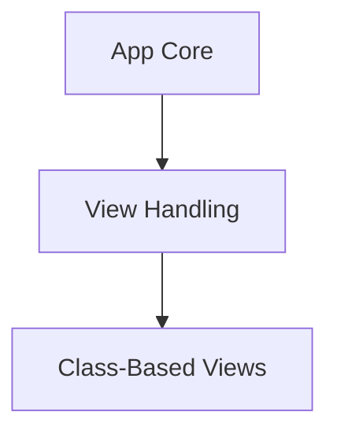

# View Handling Module

The `view_handling` module in Flask is responsible for defining the core mechanisms for creating and managing views, particularly class-based views. It provides foundational classes that allow developers to structure their request handling logic in an object-oriented manner, improving code organization and reusability.

## Architecture Overview

This module is a core component within the larger [app_core.md](app_core.md) module, which encompasses the main Flask application and blueprint management. `view_handling` specifically focuses on the abstraction of view logic, enabling the definition of callable objects that can be registered as endpoints for various HTTP methods.

The relationship between `view_handling` and its sub-modules, and its integration into the broader Flask application structure, is illustrated in the diagram below.

<!-- DIAGRAM_JSON
{
    "direction": "TD",
    "nodes": [
        {"id": "app_core", "label": "App Core", "type": "external", "link": "app_core.md"},
        {"id": "view_handling", "label": "View Handling", "type": "module"},
        {"id": "class_based_views", "label": "Class-Based Views", "type": "module", "link": "class_based_views.md"}
    ],
    "edges": [
        {"source": "app_core", "target": "view_handling"},
        {"source": "view_handling", "target": "class_based_views"}
    ],
    "groups": []
}
-->

## Sub-modules

### [Class-Based Views](class_based_views.md)
This sub-module provides the base classes, `View` and `MethodView`, for creating structured, reusable views that dispatch requests to specific methods based on the HTTP verb. This promotes cleaner code organization for handling different request types within a single view class.