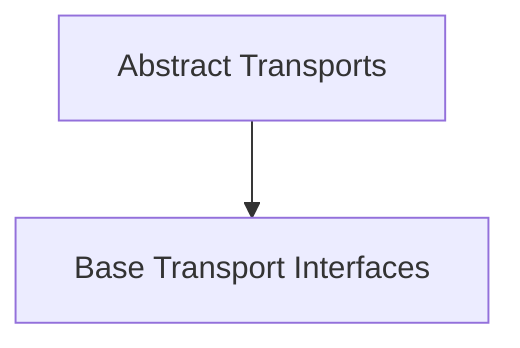

# Abstract Transports Module Documentation

## Introduction

The `abstract_transports` module serves as the foundational layer for defining how HTTP requests are sent and responses are received within the HTTPX library. It provides abstract base classes that establish the core interfaces for both synchronous and asynchronous transport mechanisms, ensuring a consistent contract for all concrete transport implementations.

This module is critical for the extensibility of HTTPX, allowing various underlying network implementations (like ASGI, WSGI, or standard socket-based HTTP) to conform to a common interface.

## Architecture Overview

The architecture of `abstract_transports` is centered around two primary abstract base classes: `BaseTransport` for synchronous operations and `AsyncBaseTransport` for asynchronous operations. These classes define the essential methods that any HTTPX transport must implement, such as `handle_request` (or `handle_async_request`) and `close` (or `aclose`).

This module acts as a blueprint, ensuring that different transport implementations can be swapped out seamlessly, providing flexibility in how HTTP communication is performed.

<!-- DIAGRAM_JSON
{
    "direction": "TD",
    "nodes": [
        {"id": "base_abstract_transports", "label": "Base Transport Interfaces", "type": "module", "link": "base_abstract_transports.md"}
    ],
    "edges": [
        {"source": "abstract_transports_entry", "target": "base_abstract_transports"}
    ],
    "groups": []
}
-->

## Sub-modules

### [Base Transport Interfaces](base_abstract_transports.md)

This sub-module defines the `BaseTransport` and `AsyncBaseTransport` abstract classes, which are the fundamental building blocks for creating custom HTTP transports in HTTPX. These classes specify the contract that all concrete transport implementations must adhere to, providing methods for handling requests and managing resource lifecycle. You can find more details in the [Base Transport Interfaces documentation](base_abstract_transports.md).
