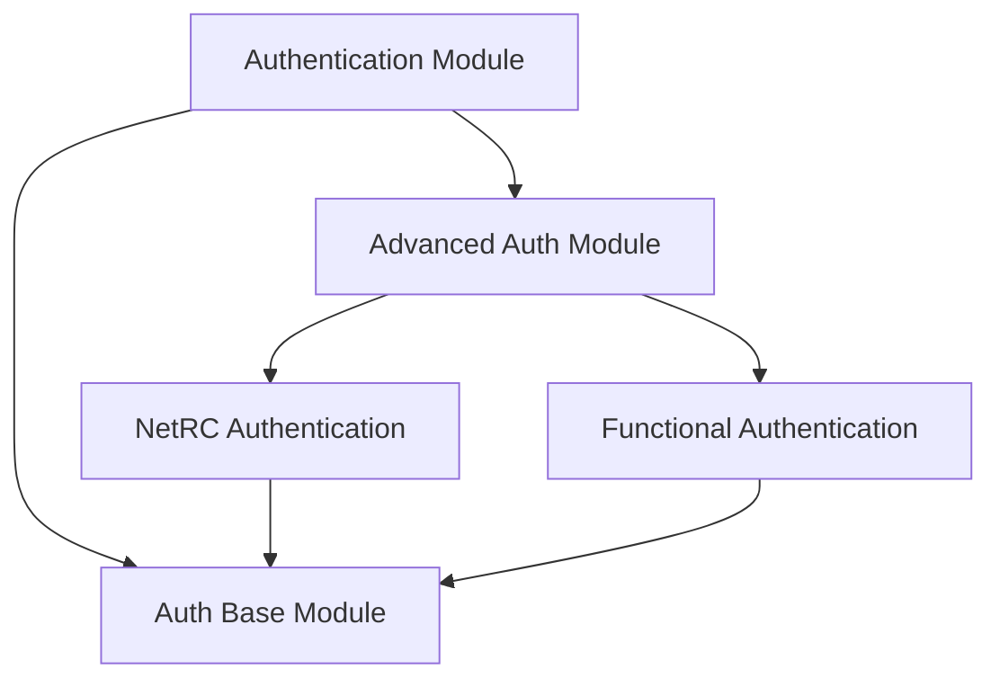

# Advanced Auth Module

The `advanced_auth` module provides advanced authentication mechanisms for HTTPX, focusing on flexible and specialized authentication methods beyond basic or digest authentication. It includes support for `netrc` file-based authentication and a functional approach for custom authentication logic.

## Architecture

The `advanced_auth` module consists of two primary sub-modules: `netrc_authentication` and `functional_authentication`. Both of these sub-modules extend the base `Auth` class provided by the `auth_base` module, ensuring a consistent interface for authentication flows within the HTTPX library. This module is a child of the `authentication` module.

<!-- DIAGRAM_JSON
{
    "direction": "TD",
    "nodes": [
        {"id": "advanced_auth", "label": "Advanced Auth Module", "type": "module"},
        {"id": "netrc_authentication", "label": "NetRC Authentication", "type": "module", "link": "netrc_authentication.md"},
        {"id": "functional_authentication", "label": "Functional Authentication", "type": "module", "link": "functional_authentication.md"},
        {"id": "auth_base", "label": "Auth Base Module", "type": "module", "link": "auth_base.md"},
        {"id": "authentication", "label": "Authentication Module", "type": "module", "link": "authentication.md"}
    ],
    "edges": [
        {"source": "authentication", "target": "advanced_auth"},
        {"source": "authentication", "target": "auth_base"},
        {"source": "advanced_auth", "target": "netrc_authentication"},
        {"source": "advanced_auth", "target": "functional_authentication"},
        {"source": "netrc_authentication", "target": "auth_base"},
        {"source": "functional_authentication", "target": "auth_base"}
    ],
    "groups": []
}
-->

## Sub-modules

*   ### NetRC Authentication
    This sub-module (see [netrc_authentication.md](netrc_authentication.md)) provides a mechanism to automatically retrieve authentication credentials from a `~/.netrc` file based on the request's URL host.

*   ### Functional Authentication
    This sub-module (see [functional_authentication.md](functional_authentication.md)) allows developers to define custom authentication logic using a Python callable function that modifies the outgoing request.
