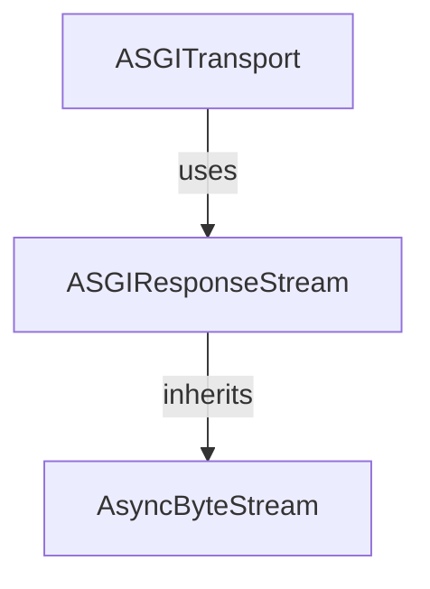

# asgi_response_stream Module Documentation

## Introduction

The `asgi_response_stream` module provides the `ASGIResponseStream` class, a specialized asynchronous byte stream implementation for handling responses within an ASGI (Asynchronous Server Gateway Interface) environment. It's designed to efficiently process and deliver the body of an HTTP response as a single stream of bytes, typically used by the `ASGITransport` to serve the response to the client.

## Architecture and Component Relationships

The `ASGIResponseStream` is a leaf module that encapsulates the byte stream logic for ASGI responses. It inherits from `AsyncByteStream` from the `types` module, ensuring it adheres to the asynchronous byte stream interface expected by other `httpx` components. Its primary consumer is the `ASGITransport` module, which utilizes `ASGIResponseStream` to manage the actual transmission of the response body.

<!-- DIAGRAM_JSON
{
    "direction": "TD",
    "nodes": [
        {"id": "asgi_response_stream", "label": "ASGIResponseStream", "type": "component", "link": null},
        {"id": "async_byte_stream", "label": "AsyncByteStream", "type": "external", "link": "types.md"},
        {"id": "asgi_transport", "label": "ASGITransport", "type": "external", "link": "asgi_transport_handler.md"}
    ],
    "edges": [
        {"source": "asgi_response_stream", "target": "async_byte_stream", "label": "inherits"},
        {"source": "asgi_transport", "target": "asgi_response_stream", "label": "uses"}
    ],
    "groups": []
}
-->


## Core Functionality

### `ASGIResponseStream`

`ASGIResponseStream` is an asynchronous byte stream class responsible for holding and iterating over the body of an ASGI response. It combines a list of byte chunks into a single byte string before yielding it.

**Class Definition:**

```python
class ASGIResponseStream(AsyncByteStream):
    def __init__(self, body: list[bytes]) -> None:
        self._body = body

    async def __aiter__(self) -> typing.AsyncIterator[bytes]:
        yield b"".join(self._body)
```

**Purpose:**

This class serves as a simple yet effective mechanism to present an ASGI response body, which might be received as a list of byte chunks, as a unified asynchronous stream. This is crucial for applications that expect to iterate over the response body in an async-compatible manner.

**Key Methods:**

*   `__init__(self, body: list[bytes])`: The constructor takes a `list[bytes]` representing the entire response body. It stores this list internally.
*   `__aiter__(self) -> typing.AsyncIterator[bytes]`: This asynchronous iterator method joins all the byte chunks in the `_body` list into a single `bytes` object and yields it. This means that consumers of `ASGIResponseStream` will receive the entire response body as a single `bytes` object in one iteration.

## How it Fits into the Overall System

The `asgi_response_stream` module, specifically the `ASGIResponseStream` class, is an integral part of the `httpx` ASGI transport layer. It acts as the bridge between the raw byte chunks received from an ASGI application and the `AsyncByteStream` interface expected by `httpx`'s higher-level response processing. The `ASGITransport` module instantiates `ASGIResponseStream` and passes it the response body, allowing `httpx` to consistently handle response content regardless of the underlying transport mechanism. This modular design ensures that the `ASGITransport` can efficiently stream response data from any ASGI-compatible application.