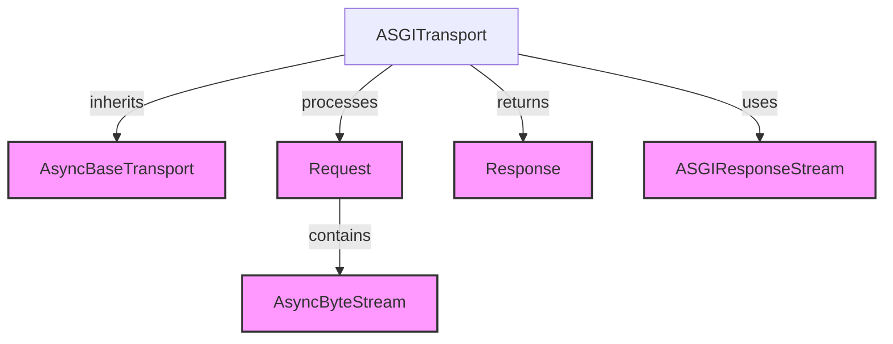

# asgi_transport_handler Module Documentation

The `asgi_transport_handler` module provides the `ASGITransport` class, a specialized asynchronous transport for directly interacting with ASGI (Asynchronous Server Gateway Interface) applications. This module is crucial for scenarios where `httpx` needs to send HTTP requests to an ASGI application running in the same process, such as during testing or integration with existing ASGI frameworks without requiring a separate network server.

## Comprehensive Documentation

### ASGITransport

The `ASGITransport` class is a concrete implementation of an asynchronous transport (`AsyncBaseTransport`) designed to bridge `httpx` requests directly to an ASGI application. It converts an `httpx.Request` into an ASGI scope and handles the `receive` and `send` callables expected by an ASGI application, then transforms the ASGI response back into an `httpx.Response`.

**Key Features:**

*   **Direct ASGI Application Integration**: Allows `httpx` to communicate with an ASGI application instance (`app`) without network overhead.
*   **Flexible Configuration**: Supports custom `root_path` for submounted applications and configurable client IP/port for the ASGI `scope`.
*   **Exception Handling**: Provides a `raise_app_exceptions` flag to control whether exceptions raised within the ASGI application are propagated.

**Core Components:**

*   **`ASGITransport(app, raise_app_exceptions=True, root_path="", client=("127.0.0.1", 123))`**
    *   **Purpose**: Initializes the transport with the ASGI application and configuration.
    *   **Parameters**:
        *   `app` (callable): The ASGI application object (e.g., a FastAPI or Starlette app instance).
        *   `raise_app_exceptions` (bool): If `True`, exceptions from the ASGI app are re-raised. If `False`, a 500 response is returned. Defaults to `True`.
        *   `root_path` (str): The path under which the ASGI application is mounted. This becomes the `root_path` in the ASGI scope. Defaults to `""`.
        *   `client` (tuple[str, int]): A `(host, port)` tuple representing the client making the request. Defaults to `("127.0.0.1", 123)`.
    *   **`handle_async_request(request: Request) -> Response`**
        *   **Purpose**: Asynchronously handles an `httpx.Request` by transforming it into an ASGI call and processing the resulting ASGI events into an `httpx.Response`.
        *   **Parameters**:
            *   `request` ([Request](models.md)): The outgoing HTTP request object. It expects `request.stream` to be an [AsyncByteStream](types.md).
        *   **Returns**: An [Response](models.md) object representing the response from the ASGI application.
        *   **Internal Workflow**:
            1.  Constructs an ASGI `scope` dictionary, populating fields like `type`, `method`, `headers`, `path`, `query_string`, `server`, `client`, and `root_path` from the `httpx.Request`.
            2.  Defines an asynchronous `receive` callable that reads chunks from the `request.stream` ([AsyncByteStream](types.md)) and sends them as `http.request` ASGI messages.
            3.  Defines an asynchronous `send` callable that captures `http.response.start` messages (for status and headers) and `http.response.body` messages (for body chunks).
            4.  Calls the ASGI `app` with the constructed `scope`, `receive`, and `send` callables.
            5.  If `raise_app_exceptions` is `True` and the app raises an exception, it's re-raised. Otherwise, a 500 response is synthesized.
            6.  Finally, it constructs an `httpx.Response` using the collected status code, headers, and an [ASGIResponseStream](asgi_response_stream.md) for the body content.

## Architecture Diagram

<!-- DIAGRAM_JSON
{
    "direction": "TD",
    "nodes": [
        {"id": "asgi_transport", "label": "ASGITransport", "type": "component", "link": null},
        {"id": "async_base_transport", "label": "AsyncBaseTransport", "type": "external", "link": "base_transports.md"},
        {"id": "request", "label": "Request", "type": "external", "link": "models.md"},
        {"id": "response", "label": "Response", "type": "external", "link": "models.md"},
        {"id": "async_byte_stream", "label": "AsyncByteStream", "type": "external", "link": "types.md"},
        {"id": "asgi_response_stream", "label": "ASGIResponseStream", "type": "external", "link": "asgi_response_stream.md"}
    ],
    "edges": [
        {"source": "asgi_transport", "target": "async_base_transport", "label": "inherits"},
        {"source": "asgi_transport", "target": "request", "label": "processes"},
        {"source": "asgi_transport", "target": "response", "label": "returns"},
        {"source": "request", "target": "async_byte_stream", "label": "contains"},
        {"source": "asgi_transport", "target": "asgi_response_stream", "label": "uses"}
    ],
    "groups": []
}
-->

