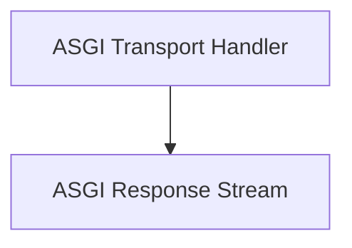

# asgi_transports Module Documentation

## Introduction

The `asgi_transports` module provides an `ASGITransport` for `httpx`, enabling direct communication with ASGI (Asynchronous Server Gateway Interface) applications. This is particularly useful for testing ASGI applications or integrating them directly into `httpx` clients without needing a full HTTP server. It handles the conversion of `httpx` requests into ASGI scope and manages the ASGI response stream.

## Architecture

The `asgi_transports` module consists of two main components:

- **ASGI Transport Handler**: Responsible for initiating the ASGI application call and managing the request/response lifecycle.
- **ASGI Response Stream**: Manages the buffering and streaming of the response body received from the ASGI application.

These components work together to provide a seamless interface for interacting with ASGI applications.

<!-- DIAGRAM_JSON
{
    "direction": "TD",
    "nodes": [
        {"id": "asgi_transport_handler", "label": "ASGI Transport Handler", "type": "module", "link": "asgi_transport_handler.md"},
        {"id": "asgi_response_stream", "label": "ASGI Response Stream", "type": "module", "link": "asgi_response_stream.md"}
    ],
    "edges": [
        {"source": "asgi_transport_handler", "target": "asgi_response_stream"}
    ],
    "groups": []
}
-->

## Sub-modules

### [ASGI Transport Handler](asgi_transport_handler.md)

This sub-module contains the core `ASGITransport` class, which implements the `AsyncBaseTransport` interface. It enables `httpx` to send requests directly to an ASGI application. The transport handles the creation of the ASGI scope, the sending of request body chunks, and the receiving and processing of the ASGI application's response.

### [ASGI Response Stream](asgi_response_stream.md)

This sub-module provides the `ASGIResponseStream` class, an `AsyncByteStream` implementation. It is used by the `ASGITransport` to encapsulate and asynchronously iterate over the response body chunks received from the ASGI application, ensuring efficient handling of streamed responses.
