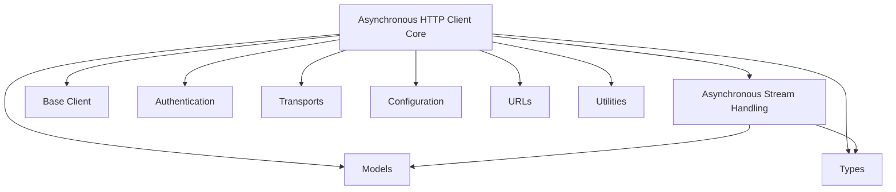

# `async_client` Module Documentation

The `async_client` module provides the core asynchronous HTTP client functionality for the `httpx` library. It enables developers to make non-blocking HTTP requests, manage connections efficiently, handle redirects, and work with various authentication and streaming mechanisms. This module is essential for building high-performance, concurrent applications that interact with web services.

## Architecture Overview

The `async_client` module is built upon a base client (`BaseClient` from [client_base.md](client_base.md)) and integrates with several other `httpx` modules to provide a comprehensive asynchronous HTTP experience. It primarily consists of the main `AsyncClient` class and a specialized `BoundAsyncStream` for handling response data asynchronously.

<!-- DIAGRAM_JSON
{
    "direction": "TD",
    "nodes": [
        {"id": "async_client_core", "label": "Asynchronous HTTP Client Core", "type": "module", "link": "async_client_core.md"},
        {"id": "async_stream_handler", "label": "Asynchronous Stream Handling", "type": "module", "link": "async_stream_handler.md"},
        {"id": "client_base", "label": "Base Client", "type": "module", "link": "client_base.md"},
        {"id": "authentication", "label": "Authentication", "type": "module", "link": "authentication.md"},
        {"id": "transports", "label": "Transports", "type": "module", "link": "transports.md"},
        {"id": "models", "label": "Models", "type": "module", "link": "models.md"},
        {"id": "configuration", "label": "Configuration", "type": "module", "link": "configuration.md"},
        {"id": "urls", "label": "URLs", "type": "module", "link": "urls.md"},
        {"id": "types", "label": "Types", "type": "module", "link": "types.md"},
        {"id": "utilities", "label": "Utilities", "type": "module", "link": "utilities.md"}
    ],
    "edges": [
        {"source": "async_client_core", "target": "client_base"},
        {"source": "async_client_core", "target": "authentication"},
        {"source": "async_client_core", "target": "transports"},
        {"source": "async_client_core", "target": "models"},
        {"source": "async_client_core", "target": "configuration"},
        {"source": "async_client_core", "target": "urls"},
        {"source": "async_client_core", "target": "types"},
        {"source": "async_client_core", "target": "utilities"},
        {"source": "async_client_core", "target": "async_stream_handler"},
        {"source": "async_stream_handler", "target": "models"},
        {"source": "async_stream_handler", "target": "types"}
    ],
    "groups": []
}
-->

## Sub-modules

This module is composed of the following key sub-modules:

*   **[Asynchronous HTTP Client Core](async_client_core.md)**: This sub-module contains the `AsyncClient` class, which is the primary interface for making asynchronous HTTP requests. It manages connection pooling, redirects, cookie persistence, and integrates with various transport layers.
*   **[Asynchronous Stream Handling](async_stream_handler.md)**: This sub-module includes the `BoundAsyncStream` class, responsible for handling the asynchronous streaming of response bodies. It ensures that response `elapsed` times are accurately recorded upon stream closure.
