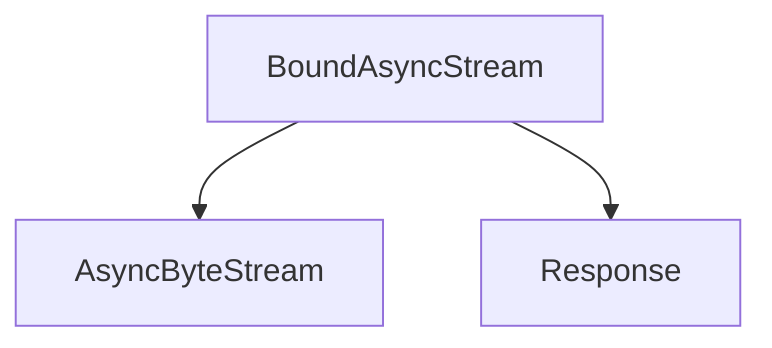

# `async_stream_handler`

The `async_stream_handler` module provides a specialized asynchronous byte stream for handling HTTP responses. It is primarily responsible for wrapping an underlying asynchronous byte stream, associating it with a response object, and accurately calculating the elapsed time for the response once the stream is closed.

## Architecture

The `async_stream_handler` module contains the `BoundAsyncStream` component, which acts as a wrapper around a raw asynchronous byte stream. It integrates with the `models` module to update the `Response` object's `elapsed` time upon stream closure and relies on the `types` module for the `AsyncByteStream` interface.

### Diagram

<!-- DIAGRAM_JSON
{
    "direction": "TD",
    "nodes": [
        {"id": "bound_async_stream", "label": "BoundAsyncStream", "type": "component", "link": null},
        {"id": "async_byte_stream", "label": "AsyncByteStream", "type": "external", "link": "types.md"},
        {"id": "response_model", "label": "Response", "type": "external", "link": "models.md"}
    ],
    "edges": [
        {"source": "bound_async_stream", "target": "async_byte_stream"},
        {"source": "bound_async_stream", "target": "response_model"}
    ],
    "groups": []
}
-->



## Core Components

### `BoundAsyncStream`

```python
class BoundAsyncStream(AsyncByteStream):
    """
    An async byte stream that is bound to a given response instance, and that
    ensures the `response.elapsed` is set once the response is closed.
    """

    def __init__(
        self, stream: AsyncByteStream, response: Response, start: float
    ) -> None:
        self._stream = stream
        self._response = response
        self._start = start

    async def __aiter__(self) -> typing.AsyncIterator[bytes]:
        async for chunk in self._stream:
            yield chunk

    async def aclose(self) -> None:
        elapsed = time.perf_counter() - self._start
        self._response.elapsed = datetime.timedelta(seconds=elapsed)
        await self._stream.aclose()
```

The `BoundAsyncStream` class is an implementation of the [AsyncByteStream](types.md) interface. Its primary function is to encapsulate another `AsyncByteStream` and a [Response](models.md) object. When the stream is closed via the `aclose` method, it calculates the total time elapsed since its creation (`_start` attribute) and updates the `elapsed` attribute of the associated [Response](models.md) object. This ensures that response timing information is accurately captured for asynchronous operations.

## Module Integration

The `async_stream_handler` module is a sub-module of `async_client`, which itself is part of the larger `client` module. It plays a crucial role in the asynchronous client's response handling pipeline by providing a mechanism to stream response bodies and record the duration of the response lifecycle. It depends on: 

*   [`types`](types.md): For the `AsyncByteStream` interface.
*   [`models`](models.md): For the `Response` object, whose `elapsed` time it updates.