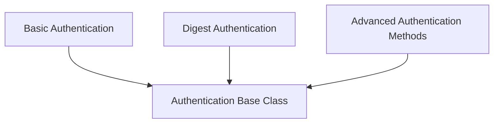

# Authentication Module

The `authentication` module in `httpx` provides a robust and extensible framework for handling various HTTP authentication schemes. It defines a common interface for authentication flows, allowing developers to easily implement and integrate different methods, from basic username/password authentication to more complex challenge-response protocols.

## Architecture Overview

The core of the authentication module is the abstract `Auth` base class, which all specific authentication schemes inherit from. This class defines the fundamental `auth_flow` method, a generator that allows for flexible handling of request and response cycles during authentication. Specialized synchronous and asynchronous flows (`sync_auth_flow`, `async_auth_flow`) are also provided for I/O-bound operations.

Different authentication mechanisms, such as Basic, Digest, and NetRC, are implemented as concrete subclasses of `Auth`. This hierarchical design ensures consistency and allows for easy extension with custom authentication logic.

## Module Components

This module is organized into several sub-modules, each responsible for a specific aspect of authentication:

*   **[Authentication Base Class](auth_base.md)**: Defines the foundational `Auth` class.
*   **[Basic Authentication](basic_auth.md)**: Implements standard HTTP Basic authentication.
*   **[Digest Authentication](digest_auth.md)**: Provides support for HTTP Digest authentication, including challenge handling.
*   **[Advanced Authentication Methods](advanced_auth.md)**: Covers more specialized authentication, such as using `.netrc` files or custom functions.

<!-- DIAGRAM_JSON
{
    "direction": "TD",
    "nodes": [
        {"id": "auth_base", "label": "Authentication Base Class", "type": "module", "link": "auth_base.md"},
        {"id": "basic_auth", "label": "Basic Authentication", "type": "module", "link": "basic_auth.md"},
        {"id": "digest_auth", "label": "Digest Authentication", "type": "module", "link": "digest_auth.md"},
        {"id": "advanced_auth", "label": "Advanced Authentication Methods", "type": "module", "link": "advanced_auth.md"}
    ],
    "edges": [
        {"source": "basic_auth", "target": "auth_base"},
        {"source": "digest_auth", "target": "auth_base"},
        {"source": "advanced_auth", "target": "auth_base"}
    ],
    "groups": []
}
-->

